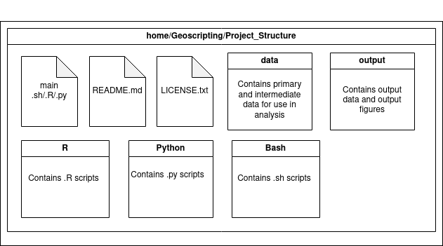

```{css, echo=FALSE}
@import url("https://netdna.bootstrapcdn.com/bootswatch/3.0.0/simplex/bootstrap.min.css");
.main-container {max-width: none;}
div.figcaption {display: none;}
pre {color: inherit; background-color: inherit;}
code[class^="sourceCode"]::before {
  content: attr(class);
  display: block;
  text-align: right;
  font-size: 70%;
}
code[class^="sourceCode r"]::before { content: "R Source";}
code[class^="sourceCode python"]::before { content: "Python Source"; }
code[class^="sourceCode bash"]::before { content: "Bash Source"; }
pre[class^="sourceCode r"] {background-color: #333366;}
pre[class^="sourceCode python"] {background-color: #555533;}
```

<font size="6">[WUR Geoscripting](https://geoscripting-wur.github.io/)</font> 

# Learning objectives

* Explore how AI can help you learn
* Learn how to find help with solving programming problems
* Learn about graphical interfaces for programming in R and Python
* Adopt some good scripting/programming habits

# Finding help
## Online resources

In the Bash tutorial, we learned how to find help about specific commands using the `man` command (short for "manual").
Similarly, in R you can find help about functions by using the `help()` or `?` commands to find the documentation of a particular function.
Python also has a `help()` command.

But how do we know *how* and *what* to write in the first place? Even the most experienced programmers run into these questions, so it's important to know how to find answers to them.

There are many places where help can be found on the internet. So in case the documentation is not sufficient for what you are trying to achieve, a search engine like Google is your best friend. Most likely by searching the right keywords relating to your problem, the search engine will direct you to online documentation, a tutorial, or to some discussions on [Stack Exchange](https://stackexchange.com/). Nowadays, search engines often even provide you with preliminary AI generated answers. It is quite likely that the problem you are trying to figure out has already been answered before, and using these resources you should be able to solve your particular problem as well.

Another online option is to ask a question to an online chatbot. Chatbots are interactive, which can help you if you are not entirely sure what keywords you want to use, and it can guide you through the process. However, you typically have a limit to how many questions you can ask a chatbot.

Whichever online source you use, you need to be critical about the information you find on the internet. Some of the information you find may refer to older versions of the software than what you are using, resulting in a mismatch. This is why, at least in Bash and R, it is recommended to first look at the built-in documentation, instead of trying to look it up online. In addition, online sources sometimes provide a workaround but not a real solution to the problem. And, of course, some of the solutions may be outright wrong and not work for you.

## Generative AI in coding

Generative AI, such as ChatGPT, has recently been gaining popularity. Generative AI models can be interacted with in multiple ways. Firstly, most known is asking GenAI questions, including questions about programming. The AI responds by providing examples of code, explanations about what the code does, and how to run it. Alternatively, software developers can manage a team of AI-agents that write code, execute (command line) commands and run code. This last option of agentic coding relies on the amount of authorization is given to AI agents. Letting others, including (especially) AI agents, execute code for you, requires a level of trust that you should be careful with. Of course, most AI solutions are not limited to code and will also answer questions on history, biology, quantum mechanics, and will even play Dungeons and Dragons with you, including throwing dice.

Generative AI models can be a great tool to enhance learning, as they can quickly answer specific questions and give coding suggestions. However, many of the limitations of web search apply to generative AI models as well (in fact, most of these models are something of a smart web search engine, as they are trained on a lot of text found on the internet). Therefore, you need to be very critical of AI-generated answers. The code that the AI generates may seem like it would solve your problem, but it may also do something incorrectly, such as calling functions that are no longer available, or even making them up altogether. Previously, many generative AI solutions were unable to provide references for their statements, and when asked, would provide a list of references and links that did not exist in reality, though this has improved in the past months. They may also answer questions completely wrong, but the explanation that they provide usually sounds quite convincing, therefore it may mislead you or make you second-guess yourself. When generative AI models are confronted about a wrong answer, they often insist that it is correct, and the longer you talk with a generative AI, the more it will get facts mixed up with its own previous answers, as it remembers and learns from its own output.

Generative AI tools can be chatbots, like ChatGPT, but they can also be tools that suggest code snippets as you write code, such as GitHub Copilot. With the latter, you start with writing documentation for a function, and then ask the AI to finish it. The AI code suggestions are based on the same models and have the same pitfalls. Most of the AI models are also paid per query, and therefore you have only a limited amount of questions you can ask it. Therefore, it is important to learn how to use it efficiently.

How to best use generative AI to help with your coding? You could ask it to solve the problem/exercise that you have and provide finished code. However, before using the output from AI, always ask yourself two questions:

1. Do I understand all of the code the AI is proposing?
2. Am I allowed to use this code?

The first question is critical to help you learn, but also to make sure you don't accidently do things you don't want to do. If you have code, and it works, but you don't understand what it does, it means you didn't learn anything, won't be able to explain the code and won't be able to debug the code if something goes wrong. Also, there is no way for you to check if the code is efficient or not. Additionally, you would not be the first one to accidentily delete files that you did not want to delete. Therefore, never trust the output of generative AI without looking at all the proposed functions and understanding how they all interact. Always cross-check the output with package documentation.

The second question is critical for legal reasons. 
As mentioned in the first tutorial about software licenses, you can only reuse code for which you have been granted a license.
Anything else is copyright, and reusing it would be breaking the law. AI output is curently under debate and pending legislation.
Companies providing AI services often state that you, the user, are allowed to use model output for any purpose; however, one cannot give rights to others that they do not own.
AI models are trained on source code from others, which is under a mix of licenses, which may or may not be compatible with the license of your code (or each other, for that matter).
And there is no way to tell which code comes from where.
However, while *code* is copyright, *ideas* behind it are not.

Therefore, to use generative AI effectively, avoid asking for code directly.
In general, for the best learning using AI, ask it to not provide an answer directly, but rather provide pointers to where you can find the answer yourself!
This is called [Socratic questioning](https://en.wikipedia.org/wiki/Socratic_questioning).
And if you do see some generated code, avoid copy-pasting it.
Rather, look at the funtions used in the code, and recreate it yourself, in a structure that makes sense for *you*, not the AI.
Make it more efficient than what the AI suggests.
And always give credit where credit is due: if you reuse code from anywhere, you need to cite the original source (aside from when the original source is licensed under a public domain license).
This includes code that you used from AI.
If you wrote code that was inspired by AI, it's also good to mention it explicitly.

There are multiple types of generative AI models.
Even though chatbots are the most well-known, there are also models that generate images, music, autocompletes code, and act as a human-like agent.
But these are all based on the same large language model (LLM) technology and have the same benefits and drawbacks.

Autocomplete models, in particular, integrate into the app you use to write code (see the section on integrated development environments below), and suggest new code based on the context.
This could be comments in the code, other functions, or the incomplete function that you are currently writing.
It can be useful to quickly produce ideas on how to implement certain functions or parts of functions.
However, note that when you use generative AI autocompletion, you need to be extra careful, as it will always provide you code, even if you don't need any, and will take credits from you, so it will stop working eventually.
It is useful to turn off AI autocompletion during the course, so you can think about the code yourself before the autocompletion provides the code for you.
The same applies as with code from chatbots: never accept the code as-is, always check what the functions are and what they do, and rewrite it to make sense for you.
And always add attribution that this part of the code was based on code generated from the AI you were using.

Agentic models, where an LLM is allowed to do work as if it was a human, i.e. allowed to read your files, use a web browser, push changes to git, etc. are also gaining popularity for the alleged productivity boost they provide. However, agentic AI is the equivalent of giving your laptop away to a colleague, including your login password, and asking to perform something on your behalf. As you can imagine, that is generally a bad idea, because not only is it not guaranteed that the task will be performed the way you want it to, but it will also seem that you were the one doing it, therefore you get all the blame. Not to mention that your secrets (such as the SSH keys you use to log into GitLab) can be compromised or exposed to third parties. Therefore, unless you have very strong security guarantees, you should not use AI agents. And certainly not during this course, since not only will you not learn anything, but it will likely mess up your computer in some way. Think of it as ordering pizza during a cooking workshop. 

Another point to consider about LLMs is the amout of computing power they require.
Each query to an AI model needs to be processed on graphics cards that are expensive and power-hungry.
This is the reason why all AI models are limited in how much you can use them.
If you use them too much, you will run out of tokens and will not be able to use them again for a while.
Beyond that, AI models can drive up electricity and hardware prices, especially for graphics cards, and is not particularly sustainable for most large models.
This is especially true for agentic AI, which requires hundreds of tokens to run, compared to a single regular chat query.
Therefore, it is also perfectly fine to choose not to use LLM AI at all.

To summarise the AI use for this course:
do make use of AI, as it can help you to get answers faster, but *never* copy the code it generates directly. Copying code without understanding it is both legally dubious and will not help you learn. Ask to explain errors you get, suggest functions to use, brainstorm about potentially useful packages, but do not copy code it produces. If you do not understand the code you are using, you will also not be able to maintain, explain and improve it, and you might be introducing security problems without knowing it. Lastly, do not use agentic AI. During the course, we will check your understanding of the code you produce to make sure you are the one learning, not the AI. For the specific AI guidelines of this course, read the course guide.

### Generative AI models

Some of the currently active chatbot generative AI tools are:

* [ChatGPT](https://chatgpt.com) - the original chatbot that started the generative AI trend. Made by a team of top AI researchers that formed into a company. It also allows the usage of custom GPTs, better suited to specific tasks, like the Python and R Wizard GPTs.
* [Anthropic's Claude](https://claude.ai/) - a model that is known to be advanced in coding tasks, such as translating code between different languages.
* [Microsoft Copilot](https://copilot.microsoft.com/) - Microsoft's version of ChatGPT, also built on the GPT framework. It tries to provide references, though these are not guaranteed to be the ones the model actually used.
* [Google Gemini](https://gemini.google.com/) - Google's rival to ChatGPT. It has recently improved a lot compared to Google's older models. Will also provide sources or references, but not for everything and not always accurate. Can integrate with your Google Workspace (Gmail, Drive, YouTube), for example, it's a great way to summarize a YouTube tutorial into bulletpoints or clear steps.

Some of the code completion tools:

* [GitHub Copilot](https://github.com/features/copilot) - GitHub AI, you get more free credit if you get the Education Pack from GitHub. Integrated into most IDEs.

Note that all of these generative AI tools are built on proprietary models and accessed through proprietary APIs.
There are also open-weight models that you can download on your own computer and run them on your own.
This can be useful if you don't want to give your data to the company running the model, or if you have no internet connection, or if you want to avoid running out of credit.
The downside is that the models running on your own computer are slow (you get to see the answer appearing word by word) and do not integrate easily with IDEs.
A server and open-weight model list can be find on the [Ollama](https://ollama.com/) and [Hugging Face](https://huggingface.co) websites.
A web interface that links to Ollama can be found on [Open WebUI](https://docs.openwebui.com/).

## Question and answer forums

However, it may also happen that you discover a *bug* or something that you would qualify as abnormal behavior, or that you really have a question that no one has ever asked (corollary: has never been answered). In that case, you may submit a question to an appropriate Stack Exchange (e.g. [Unix & Linux for Bash questions](https://unix.stackexchange.com/), or contact the author of the package you are using (often by filing an issue on the package's GitHub page).

Stack Exchange has a few rules, and it's important to respect them in order to ensure that:

* no one gets offended by your question,
* people who are able to answer the question are actually willing to do so,
* you get the best quality answer.


So, when posting to Stack Exchange: 

* Be courteous.
* Provide a brief description of the problem and why you are trying to do that.
* Provide a reproducible example that illustrate the problem, reproducing the eventual error.
* Do not expect an immediate answer (although well presented questions often get answered fairly quickly).


## Reproducible examples (reprex)

Formulating your questions properly is indispensable when asking a question to the online community. Being able to write a reproducible example has many advantages:  

- It may ensure that when you present a problem, people are able to answer your question without guessing what you are trying to do. 
- Reproducible examples are not only to ask questions; they may help you in your thinking, developing or debugging process when writing your own functions. 
    - For instance, when developing a function to do a certain type of raster calculation, start by testing it on a small subset file, and not directly on your actual data that might be covering the whole world.

One could define a reproducible example by:

- A piece of code that can be executed by anyone who can run the programming language you are using, independently of the data present on their machine or any preloaded variables. 
- The computation time should not exceed a few seconds and if the code automatically downloads data, the data volume should be as small as possible.

*So basically, if you can quickly start a terminal on your neighbour's computer while he is on a break, copy-paste the code without making any adjustments and see almost immediately what you want to demonstrate; congratulations, you have created a reproducible example.*

Let's illustrate this by an example.

I want to move all directories with Star Wars film subtitles to the directory `../starwars`, but not move any of the Star Trek directories. Here is a piece of code that can recreate my directory structure:

```{bash, eval=FALSE}
mkdir -p films/{"the phantom menace","attack of the clones","revenge of the sith","a new hope","the empire strikes back","return of the jedi",\
"the motion picture","the wrath of khan","the search for spock","the voyage home","the final frontier","the undiscovered country","generations","first contact","insurrection","nemesis"} starwars
cd films

# I tried this, but it did not move the phantom menace, a new hope and the empire strikes back
mv *\ t* ../starwars
```

As you can see from this example, the problem is reproduced on any computer that is running Bash, and the changes are restricted to creating two directories, namely, `films` and `starwars`, which are easy to clean up afterwards.


# Graphical user interfaces (GUIs) and integrated development environments (IDEs)

It's time for us to actually delve into R and Python programming!
But how do we do that efficiently?
We could write scripts in Notepad and run them, but that is not particularly efficient, as there are many graphical user interfaces (GUIs) that can help us write code faster.
Comprehensive GUIs that help with writing, debugging and packaging code are called integrated development environments (IDEs).

## R

There are multiple IDEs for R.
The most popular one is *RStudio*. it is developed by posit, a company that is very active in contributing to R (Hadley Wickham and others).
RStudio is cross-platform and open-source.
It comes in two types: *RStudio Desktop* is a regular desktop app, and *RStudio Server* is meant for running on a remote server, to which you can connect through your web browser.
Interestingly enough, the desktop version is in fact just *RStudio Server* running locally, with an integrated web browser based on *Google Chrome*.
Posit recently released a new IDE called positron. Although posit does not say it definitively and they will keep maintaining RStudio, new features will be [primarily implemented](https://positron.posit.co/faqs.html) in Positron

Even though *RStudio* is very popular, it is not the only IDE for R.
*RKWard* is an alternative IDE, aimed at easier learning of R for people coming from other statistical software, such as *SPSS*.
It includes menus for common statistical analysis algorithms, such as getting descriptive statistics, running statistical tests, and making plots.
It also includes an editor for data tables.
*RKWard* is an open-source native desktop app that is developed on Linux, but has also been ported to other platforms, including Windows.

Furthermore, there are cross-language GUIs/IDEs, such as *Jupyter*, whose name is a portmanteau of **Ju**lia, **Pyt**hon and **R**.
*Jupyter* can run different language interpreters, what it calls kernels, for each script that is open, therefore scripts in multiple languages can be edited at the same time in the same interface.

One thing to keep in mind is that there is a distinction between a programming language, such as R, and its IDEs, such as *RStudio*.
Which IDE you use is up to your own personal preference.
Which IDE you used to develop code does not matter, because in the end you just have an R script that can be run on any of the IDEs, or directly from the command line.
What does matter is that the script is written in the R language, as the users will need to have the R interpreter installed in order to run the script.
Likewise, the packages that you use in your script are also important, as the users will need to install them before they can run your script.
Therefore, whenever you refer to scripts and packages, for instance when writing a thesis, you need to specify what language the scripts are written in, and what packages (and ideally what versions) you used.
You should not mention which IDE you used, as that is irrelevant to the readers.
For example, you should not write "the scripts are written in RStudio", but rather, you should write "the scripts are written in R, using package `lattice` version 0.22".
In fact, you should also cite the authors of the language and the packages you used.
R includes a handy function `citation()` to help you cite:

```{r}
citation()
```

It also works on packages:

```{r}
citation("lattice")
```

There are more IDEs, such as R Commander, but we will not be talking about them within the scope of this course.
Nevertheless, feel free to use whichever IDE is your favourite!

```{block type="alert alert-info"}
As a sidenote, IDEs can change how certain commands in R work.
For instance, there are two commands in R that load packages: `library()` and `require()`.
Most IDEs make no difference between the two; `require()` just gives a warning if it can't load a package, whereas `library()` stops with an error.
However, in *RKWard*, running `require()` on a package that does not exist will result in its package management dialogue opening with the required packages preselected for installation, and closing the dialogue will result in a successful loading of the package (if it was installed successfully).
Therefore, do not use `require("package")` to check if `package` is installed, otherwise it will be installed twice under RKward.
Instead, you can use `"package" %in% installed.packages()`.
```

Next, let's look a bit more in detail at the IDEs described above and their configuration options.

### RStudio

In the virtual machines provided in the course, RStudio is already installed for you.
In case you are working on your own computer and would like to know how to install *R* and *RStudio*, see the [RStudio website](https://www.rstudio.com/products/rstudio/download/).

If you are new to *RStudio* take a look at the following summary YouTube video about how to use RStudio: [Intro to RStudio (6 min)](https://www.youtube.com/watch?v=FIrsOBy5k58).
In it you will learn how to navigate the RStudio environment and even run some code.
This will be helpful for later in the course.

Additionally, the first time you open *RStudio* it's helpful to change some global settings.
To do this go to *Tools* → *Global Options...* in the top menu bar of *RStudio*.
The following box should appear.
Set the settings to match that of the screenshot, namely, *Never save the workspace to .RData file on exit* and uncheck the boxes under *History* and *Restore .RData*.
The effect is that RStudio will stop prompting you on exit about whether you want to save the workspace and reload it on next start, which will save you time answering prompts and save time opening RStudio.
Most importantly, it will make sure that restarting RStudio leaves you with a clean environment, equal to what another user of your code would start with, so you can properly test your code, and restart RStudio in case something goes wrong to get back to a clean state.


To make a new script, click on *File* -> *New File* -> *R Script*, and a new editor pane will open, allowing you to write code.
When you write a line, you can run each individual line that your text cursor is on by hitting *Ctrl+Enter*.
To install packages, aside from using the R console below (`install.packages()` function), you can install them through the graphical *Packages* pane at the lower right corner of the screen, where you can search for and install packages and their updates.

### RKWard

RKWard is also preinstalled on the virtual machine.
On your own computer, you can get it from the [RKWard website](https://rkward.kde.org/Download_RKWard.html).

When you launch RKWard, it will start a first-start setup wizard, that suggests installing some additional packages.
Feel free to simply dismiss it by clicking *Cancel*.
To start a new file, click *Create* -> *Script File*.
Typically you can also use *Ctrl+Enter* to run each line that your cursor is on.
RKWard sometimes gives too many autocompletion tooltips, you can disable them by going to *Settings* -> *Configure Script Editor* and unchecking *Function call tip*.

You can install packages, aside from using the `install.packages()` function in the R console below, through *Settings* -> *Manage R packages and plugins...*.
You will be prompted to select a mirror, just use the top one (*0-Cloud*) to automatically select the best one.
The tab *Install / Update / Remove R packages* lists all packages that are available on CRAN, packages that are installed and are the latest version, and packages that are installed but can be updated.
To install packages, click the checkbox next to their names, and to remove packages, uncheck them.
The changes will only be applied once you click *Apply*.

## Jupyter

*Jupyter* comes in two types as well: *Jupyter Notebook* and *Jupyter Lab*.

*Jupyter Notebook* is an older interface that is based on the notebook concept, where you combine text with code in a single (`.ipynb`) file.
*Jupyter Notebooks* are extremely popular in the Python community, as they are easy for writing documentation and tutorials (vignettes).
They are displayed automatically in GitLab and GitHub.
However, *Jupyter Notebooks* are less popular in R, because *RMarkdown* provides a similar solution for R (and recently *Quarto* extends *RMarkdown* beyond R, therefore directly competing with *Jupyter Notebooks*).
An issue with *Jupyter Notebooks* is that, due to mixing of text and code, you cannot run a notebook from the terminal, or in fact use any IDE other than *Jupyter Notebook*.
They are also not well compatible with *Git*, as multiple developers cannot edit the same file without causing spurious conflicts, albeit there are workarounds.

*Jupyter Lab* is a newer interface that allows directly editing R and Python files, in addition to opening *Jupyter Notebooks*.
Its advantage is that it can edit multiple scripts in multiple languages at the same time, but its disadvantage is that it cannot provide functionality that is specific to any one language, therefore it is relatively barebones.

Like *RStudio Server*, *Jupyter* is mainly designed to be run on a server.
It can be run locally by launching a server and then connecting to it through a web browser.
However, since *Jupyter* is written in Python, it requires specific Python setup to install.
We will learn more about how to run *Jupyter* in the Python part of the course.

The fact that *Jupyter* is open source and designed to work as a server has created opportunities for Google to create something of a Google Docs version of *Jupyter*, that is called *Google Collaboratory*, or *Google Colab* for short.
Google provides every user of *Google Colab* with computer resources to run Python or R.
It is therefore the easiest way to run Python without changing anything on your own computer.
If anything goes wrong, you can always create a new *Colab* notebook and start over.

First, go to the [Google Colab website](https://colab.research.google.com) and click on *+ New notebook* to create a *Colab* notebook.
The default kernel type in *Google Colab* is Python, but you can change it to R by going to *Runtime* -> *Change runtime type* and selecting *R*.
Click *Connect* at the top right to start the kernel, so that you can run code blocks.

Note that *Google Colab* has a special character, the exclamation point `!`, which allows you to run Bash commands within Python code blocks.
This is very useful and important for installing Python packages, as they are typically installed using the `pip` command from Bash.
You can try running a code block like this to install and load the rasterio package:
```{python, eval=FALSE}
!pip install rasterio
import rasterio
```

## Python

Aside from Jupyter, you can use other IDEs for Python.
A popular IDE for Python is Microsoft [Visual Studio Code](https://code.visualstudio.com/), which is also installed on your virtual machine.
Another is [PyCharm](https://www.jetbrains.com/pycharm/), but it is not preinstalled as its installation is more difficult to automate.
Therefore, in the rest of the tutorial we will cover VSCode, but if you feel comfortable with PyCharm (or another IDE), you can keep using it.


# The overall system architecture


{width=100%}

To recap, the overall system architecture is comprised of integrated development environments (IDE), engines, packages, bindings, and libraries. Let's start with the engine, the core program that executes the foundation or crucial tasks of the programming language. The most relevant engines in this course are Python and R. To interact with the engine, we can either code in the command line directly or we can use an IDE, which provides many tools and features for working with the engine integrated in a single environment. An IDE allows the developer to write code, test it, and debug it all in a single software application.

We then install packages in the IDE, these are collections of related code files, libraries, and resources that are related and compatible with each other. Libraries are pre-written code that provide specific functions and services. The idea of libraries and packages is to make coding more efficient by the reuse of common functions.

# Good programming habits

## Project structure

How you organise files in your project directory (repository) is very important.
Keeping a consistent structure allows you to easily share your project with collaborators, easily remember what is where when you come back to work on the project later, and allows setting up automatic testing of your software for bugs (Continuous Integration, CI).
It also allows you to easily convert a project into a package.

To practice keeping a consistent project structure, in this course we will be following the structure below: 



* A `main` script at the root of the project. This script performs step by step the different operations of your project. It is the only non-generic part of your project (it contains executable code outside functions, including paths, already set variables, etc.). The file extension of this file will depend on what language you are using for your project. We typically call these files `main.r` and `main.py`, but it could also be e.g. `task1.r`.
* As we will be working with multiple languages throughout this course, we will keep things organized by placing scripts in a directory per language.
  * For R and Bash we will use the directories `R/` and `Bash/`. These directories should contain functions you have defined as part of your project. 
  * In python functions are stored in a directory with a name relevant to the project. For example when working on flood mapping, you would put functions in a directory called `floodmapping`. For smaller projects (< 5) functions, all functions can go in 1 script. For bigger projects functions are stored in multiple files, split by functionality. More on python project organization see the [Hitchhiker's guide to Python](https://docs.python-guide.org/writing/structure/#structure-of-code-is-key).
  * Functions should be as generic as possible and are imported and called by the `main` script. In R you would write `source(R/myFunction.R)`, in python you would write `from floodmapping import *`
* A `data/` subdirectory: This directory contains data sets of the project. Since Git is not as efficient with non-text files, and GitLab has storage limits, you should only put small data sets in that directory (<2-3 MB). Typically, you do not include it in your git repository at all; rather, this directory is created from your `main` script, and is used to store data downloaded from the internet. It can be safely removed after the script is finished running.
* An `output/` subdirectory (when applicable), where you place the final result of running your script. This should also not be tracked by git: your scripts create the output, so there is no need to store it.
* A `README.md` file should be included, this file should contain a description of your project, along with a description of what other packages your script needs to function correctly, and any other instructions needed to correctly run your code. 
* Finally, you should include a `LICENSE.txt` file with the software licence which you would like your code to have.

```{block type="alert alert-danger"}
**Warning**: **Never** upload large (raster) files to git! If your repository exceeds 100 MiB in size, it will no longer be loaded by CodeGrade. Deleting the files will have no effect, because Git stores the history forever. **Fixing a repository like that is extremely complicated and time-consuming!**

**Note**: Without a `LICENSE` file, your code is copyright, which means that nobody has the right to even read it, let alone run it! Make sure to always specify a license that would at least allow that.
```

### Example `main` file

Typically the header of your main script will look like the following:

#### In R (`main.R`)

```{r, eval=FALSE}
# Team Teamname (John Doe and Jane Smith)
# January 2020
# Import packages
library(terra)
library(sf)
# Source functions
source('R/download_data.R')
source('R/function2.R')
# Use sourced function to download data to the directory "data"
download_data("data")
# Load datasets 
postboxes <- st_read('data/postbox_locations.gpkg')
# Then the actual commands
```

#### In Python (`main.py`)

```{python, eval=FALSE}
# Team Teamname (John Doe and Jane Smith)
# January 2020
# Import packages
import geopandas as gpd
import matplotlib.pyplot at plt

# Import functions
# The "as download" part is used to scode functions. In this example, we can distinghuish our own implemented download functions from other functions called download_data
import myproject.download as dl

# Use imported function to download data to the directory "data"
dl.download_data("data")

# Load datasets 
postboxes = gpd.read_file('data/postbox_locations.gpkg')
# Then the actual commands
```

## Working directory, relative and absolute file paths

*At the end of the following section you should be able to explain the difference between the following:* 

* relative path
* absolute path
* working directory, 
* And the following special directories:
	 * ` . `
	 * ` .. `
	 * ` / ` or the **root** directory

In the R and Python examples above we load the data sets by indicating the file location from the data directory `"data/postbox_locations.gpkg"`.  However, you may have many data folders on your computer, for all types of different projects. So how does the system know to look in the correct one? Moreover, if you share your script with a friend the location of their project and data folders will be different than that of your setup.  It would be a nuisance if they had to change all references to these files in their script. To deal with these issues, we use **relative file paths**. 

In **relative** file paths, we don't include the location of the project (**working**) directory itself, these paths are *relative* to the *working directory* (the "Project_Structure" folder).  In the example above, the **relative** file path for the post box locations file would be `data/postbox_locations.gpkg`, whereas the **absolute** file path would be `"/home/osboxes/Geoscripting/Project_Structure/data/postbox_locations.gpkg"`. The **absolute** file path refers to a file from the **root** of the entire file system. On Linux (and other UNIX-like systems like macOS), absolute file paths **always** start with ` / `. 

```{block, type="alert alert-danger"}
**Note**: on Windows, you might see a backslash (`\\`) being used as a path separator instead of a slash (`/`). **Don't do this**! In many languages, including R, a backslash denotes an [escape sequence](https://en.wikipedia.org/wiki/Escape_sequence). In addition, a backslash is not a valid path separator on non-Windows platforms, whereas both a slash and a backslash are valid on Windows. So save yourself the trouble and **always use a slash as a path separator**!
```

So what is the **working directory**? By convention, the working directory is the same as the location of the script which you are working on. This means that you can simply assume that whoever runs your script, will run it from the directory that your script is located.

```{block, type="alert alert-danger"}
**Note**: this also means that when you test others' code, you should also make sure to run it from the directory that the script is located, unless stated otherwise!
```

To refer to directories or files that are within the working directory, we simply use their names. So to refer to a directory called `R` in our working directory, we type `R`. To refer to a file or directory within another directory, we type the name of the directory, a slash, and then the name of the file/directory, for instance, `R/function1.R`.

If we want to refer to a file or directory that is above the indicated directory, we use the special directory ` .. `. For instance, if our `main.R` is not in our project root, but located in the sub-directory `demo` (therefore our working directory is `demo`), we would refer to our `function1.R` file as `../R/function1.R`. Another special directory is ` . `, which refers to the indicated directory itself.

When making Git repository, you want to make sure that all your code is *portable* and self-contained, i.e. you can run it from any computer, and ideally using any operating system. That means that as a rule of thumb you should **always use relative file paths** in your scripts.

```{block, type="alert alert-success"}
> **Question 1**: what would be the location of this file: `././R/./.././R/./././function2.R`? How about `/./R/./.././R/./././function2.R`? What would be the meaning of `C:/Windows/cmd.exe` on Linux? Is it a relative or absolute file path?
```

## Documentation

As we have seen in the package examples, documentation of code is extremely important to understand what your code is doing.
It's not only for others reading your code, but also for yourself, when you have to revisit code you haven't touched in a while.
If you follow the good scripting habits mentioned above, you will already have your code divided into reusable functions that are in their own function files.
Each function should have enough comments to understand each step the function is performing.
Comments are any words after the `#` character, in either language.
Same goes for the main script, it should also have each step described.
But you don't need to make it redundant: if it's already clear from the function name what it does, it's useless to repeat it in a comment.
Rather, you would describe sections of code at once, e.g. what a loop does by itself, rather than its individual steps.
In addition, if you use code from someone else, make sure to obey the license of the code you are using, and give credit to the original author using comments.

In addition to comments of your code, each function should also have a description and an explanation for all of its arguments.
In both R and Python, there is a special way to add this information in comments next to the function definition, so that help files can be generated out of them automatically.
The systems have different conventions, but effectively achieve the same purpose.

In Python, the system is called [Docstrings](https://peps.python.org/pep-0257/).
It consists of strings using triple quotes, that effectively acts as a multi-line comment.
Here's an example of a Python function documented with a Dosctring using the official reStructuredText (Sphinx) format:

```{python}
def hello(name):
  """Greet a person.
  
  Give a customised "Hello" greeting for the input name.
  
  :param name: A string containing the name of the person to greet.
  :return: A greeting string.
  """
  return("Hello " + name)
```

The Docstring will be automatically printed when you run `help(hello)`, and will be converted into a nice webpage using tools such as [Sphinx](https://sphinx-rtd-tutorial.readthedocs.io/en/latest/install.html).

In R, the system is called [roxygen2](https://roxygen2.r-lib.org/articles/rd.html) and is provided by the `roxygen2` package.
Here's an equivalent example in R, using roxygen2:

```{r}
#' Greet a person
#' 
#' Give a customised "Hello" greeting for the input name.
#' 
#' @param name A string containing the name of the person to greet.
#' @returns A greeting string.
hello <- function(name) {
  return(paste("Hello", name))
}
```

The roxygen2 package was created to make it easier to write documentation in R, so that documentation does not have to be separate from the code.
The `roxygenize()` function generates the documentation files from the comments automatically, and then the documentation appears when running `?hello` in our example.

## Summary

Increasing your scripting/programming efficiency goes through adopting good scripting habits. Following the guidelines above will ensure that your work:

* Can be understood and used by others.
* Can be understood and reused by you in the future.
* Can be debugged with minimal effort.
* Can be re-used across different projects.
* Is easily accessible by others.

The summary of good practice guidelines below is not exhaustive, but already constitutes a good basis that will help you getting more efficient now and in the future when working on scripting projects:

* Comment your code.
* Write functions for code you need more than once:
* Document your functions.
* Keep consistent style.
* Make your own packages, or at least keep a similar directory structure across your projects. 
* Use version control to develop/maintain your projects and packages.


<!-- This find help part is moved back from linux to project management on 7th August 2025-->

<!-- Move the following sections from into to linux to here, once we move Linux out:

# How to find help

## Reproducible examples
-->
