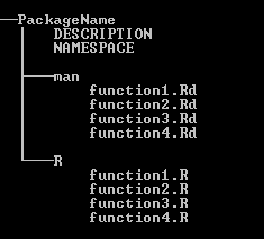

# Today's learning objectives
At the end of the lecture, you should be able to


* Find help for R related issues
* Produce a reproducible example
* Adopt some good scripting/programming habits
* Make efficient use of RStudio projects
* Use control flow for efficient function writing
* Create a R package
* Use version control to develop, maintain, and share with others your R packages


# Introduction

During the previous lecture, you saw some general aspects of the R language, such as an introduction to the syntax, object classes, reading of external data and function writing. Today the emphasis of the lecture is mostly oriented toward carrying an R project. Therefore, some recurrent aspects of project development, such as, how to find help, or techniques to organize your code and your projects are covered in the lecture.
Scripting means that you often go beyond easy things and therefore face challenges; as a consequence, it is likely that at one moment or another, you will have to go look for help. Part of this lesson is intended to guide you through ways of finding help, including posting to the mail list and writing a reproducible example. In addition, this lecture goes through a couple of essential ''good practices'' when working on geo-scripting projects. Not all aspects of good practices are covered, however, for those of you who are curious to know more about version control, R package building, etc, be sure to check the reference section of this document.


# Finding help

There are many place where help can be found on the internet. So in case the function or package documentation is not sufficient for what you are trying to achieve, google is your best friend. Most likely by googling the right key words relating to your ''problem'', google will direct you to the archive of the R mailing list, or to some discussions on [Stack Exchange](http://stackexchange.com/). These two are reliable sources of information, and it is quite likely that the problem you are trying to figure out has already been answered before.

However, it may also happen that you discover a ''bug'' or something that you would qualify of abnormal behavior, or that you really have a question that no-one has ever asked (corollary: has never been answered). In that case, you may submit a question to one of the R mailing list. For general R question there is a general [R mailing list](https://stat.ethz.ch/mailman/listinfo/r-help), while the spatial domain has its own mailing list ( [R SIG GEO](https://stat.ethz.ch/mailman/listinfo/r-sig-geo) ). Geo related question should be posted to this latter mailing list.


Warning, these mailing list have heavy mail traffic, use your mail client efficiently and set filters, otherwise it will quickly bother you.


These mailing lists have a few rules, and it's important to respect them in order to ensure that:


* no-one gets offended by your question,
* people who are able to answer the question are actually willing to do so,
* you get the best quality answer


So, when posting to the mail list: 


* Be courteous,
* Provide a brief description of the problem and why you are trying to do that.
* Provide a reproducible example that illustrate the problem, reproducing the eventual error
* Sign with your name and your affiliation
* Do not expect an immediate answer (although well presented question often get answered fairly quickly)


# Creating a reproducible example

Indispensable when asking a question to the online community, being able to write a reproducible example has many advantages.
First it may ensure that when you present a problem, people are able to answer your question without guessing what you are trying to do. But reproducible examples are not only to ask questions; they may help you in your thinking, developing  or debugging process when writing your own functions. For instance, when developing a function to do a certain type of raster calculation, start by testing it on a small auto-generated rasterLayer object, and not directly on your actual data covering the entire universe 
dots

## But what is a reproducible example exactly?

Well, one could define a reproducible example by a piece of code that can be executed by anyone who has R, independently of the data present on his machine or any preloaded variables. The computation time should not exceed a few seconds and if the code automatically downloads data, the data volume should be as small as possible.
So basically, if you can quickly start a R session on your neighbour's computer while he is on a break, copy-paste the code without making any adjustments and see almost immediately what you want to demonstrate; congratulation, you have created a reproducible example.

Let's illustrate this by an example.
I want to perform values replacements of one raster layer, based on the values of another raster Layer. (We haven't covered raster analysis in R as part of the course yet, but you will quickly understand that for certain operations rasters are analog to vectors of values).

```{r}
# Create two rastersLayer objects of similar extent
library(raster)
r <- s <- raster(ncol=50, nrow=50)
# fill the raster with values
r[] <- 1:ncell(r)
s[] <- 2 * (1:ncell(s))
s[200:400] <- 150
s[50:150] <- 151
# perform the replacement
r[s %in% c(150, 151)] <- NA
# Visualize the result
```

```{r, raster-1, echo=TRUE, fig=TRUE, include=TRUE}
plot(r)
```


Useful to know when writing a reproducible example; instead of generating your own small datasets (vectors or RasterLayers, etc) as part of your reproducible example, use some of R ''built-in'' datasets. They are part of the main R packages.
Some popular datasets are: `cars`, `meuse.grid_ll`, `Rlogo`, `iris`, etc
The [auto completion](http://en.wikipedia.org/wiki/Autocomplete) menu of the `data()` function will give you an overview of the datasets available. (In RStudio like in most script editing environments autocompletion can be toggled by pressing the tab key, use it without moderation.)

```{r}
# Imports the variable cars in the working environment
data(cars) 
class(cars)
# Visualizes the first six rows of the variable
head(cars) 
```

```{r, cars, echo=TRUE, fig=TRUE, include=TRUE}
# The plot function on this type of dataset (class = data.frame, 2 column)
# automatically generates a scatterplot
plot(cars)
```

Another famous data set is the meuse data set, providing all sorts of spatial variables spread across a part of the meuse watershed.
The following example compiled from the help pages of the sp package.

```{r}
## Example using built-in dataset from the sp package
library(sp)
# Load required datastes
data(meuse)
# The meuse dataset is not by default a spatial object
# but its x, y coordinates are part of the data.frame
class(meuse)
coordinates(meuse) <- c("x", "y")
class(meuse)
```

Now that the object belongs to a spatial class, we can plot it using one of the vector plotting function of the sp package. See the resulting in the figure below.

```{r, meuse1, echo=TRUE, fig=TRUE, include=TRUE}
bubble(meuse, "zinc", maxsize = 2.5,
       main = "zic concentrations (ppm)", key.entries = 2^(-1:4))
```

The sp package help page contain multiple examples of how to explore its meuse built-in data set. Another example of multiple plots using `meuse.grid` is given in the figure below.

```{r, meuse2, echo=TRUE, fig=TRUE, include=TRUE}
# Load meuse.riv dataset
data(meuse.riv)
# Create an object of class spatialPolygons from meuse.riv
meuse.sr <- SpatialPolygons(list(Polygons(list(Polygon(meuse.riv)),"meuse.riv")))
# Load the meuse.grid dataset
data(meuse.grid)
# Assign coordinates to the dataset and make it a grid
coordinates(meuse.grid) = c("x", "y")
gridded(meuse.grid) = TRUE
# Plot all variables of the meuse.grid dataset in a multiple window spplot
spplot(meuse.grid, col.regions=bpy.colors(), main = "meuse.grid",
       sp.layout=list(
           list("sp.polygons", meuse.sr),
           list("sp.points", meuse, pch="+", col="black")
           )
       )
```


# Good scripting/programming habits

Increasing your scripting/programming efficiency goes through adopting good scripting habits. Following a couple of guidelines will ensure that your work:

* Can be understood and used by others
* Can be understood and reused by you in the future
* Can be debugged with minimal efforts
* Can be re-used across different projects
* Is easily accessible by others
  

  
In order to achieve these objectives, you should try to follow a few good practices. The list below is not exhaustive, but already constitutes a good basis that will help you getting more efficient now and in the future when working on R projects.


* Write short functions.
* Make your functions generic and flexible, using **control flow**
* Comment your code
* Follow the R [style guide](http://google-styleguide.googlecode.com/svn/trunk/Rguide.xml) (The aim of having a formatted style guide is to increase readability of your code by others. In that regard, indentation, use of <- instead of = as assignment operator and placement of curly braces are of particular relevance when writing functions. Proper configuration of your script editor allows you to automatically implement some of these guidelines without having to think too much about it.)
* Document your functions
* Build packages
* Work with projects
* Keep a similar directory structure across your projects
* Use **version control** to develop/maintain your projects and packages

Note that the RStudio IDE makes a lot of these good practices a lot easier and you should try to take maximum advantage of it. Take a moment to explore the menus of the RStudio session that should already be open on your machine. Particular emphasis will be given later in this tutorial on projects, project structure and use of version control.

Below is an example of a function written with good practices and without.
First the good example:

```{r}
ageCalculator <- function(x) {
    # Function to calculate age from birth year
    # x (numeric) is the year you were born
    if(!is.numeric(x)) {
        stop("x must be of class numeric")
    } else { # x is numeric
        # Get today's date
        date <- Sys.Date()
        # extract year from date and substract
        year <- as.numeric(format(date, "%Y"))
        if(year <= x) {
            stop("You aren't born yet")
        }
        age <- year - x
    }
    return(age)
}

ageCalculator(1985)
```

29, what a beautiful age for learning geo scripting.

Then the bad example:

```{r}
# DON'T DO THAT, BAD EXAMPLE!!!
funTest_4 <- function(x) {
if(!is.numeric(x)) {
stop("x must be of class numeric")
}
else {
a = Sys.Date()
b <- as.numeric(format(a, "%Y"))
b - x
}
}

funTest_4(1985)
```
It also works, but which of the two is the easiest to read, understand, and modify if needed? ... Exactly, the first one.
So let's look back at the examples and identify some differences:

* Function name: Not very self descriptive in the second example
* Function description: Missing in the second example
* Arguments description: Missing in the second example
* Comments: The second example has none (Okay, the first one really has a lot, but that's for the example)
* Variables naming: use of `a` and `b` not very self descriptive in second example
* Indentation: Missing in the second example
* Control flow: Second example does not check for irrealistic dates

You haven't fully understood what is control flow or are not fully comfortable with functions writing yet? We'll see more of that in the following sections. 

## Function writing

The objective of this section is to provide a few advice to help you write efficiently function. That is functions that are simple, generic and flexible, so that they integrate well in a processing/analysis chain and can easily be re-used in a slightly different chain if needed.
More flexibility in your function can be achieve thanks to some easy tricks provided by control flow. The following section develops further this concept and provides examples of how control flow can help your functions becoming more flexible.

## Control flow
Control flow refers to the use of conditions in your code that redirect the flow to different directions depending on variables values or class. Make use of that in your code, as this will make your functions more flexible and generic.

## Object classes and Control flow
You have seen in a previous lesson already that every variable in your R working environment belongs to a class. You can take advantage of that, using control flow, to make your functions more flexible.

A quick reminder on classes

```{r}
# 5 different objects belonging to 5 different classes
a <- 12
class(a)

b <- "I have a class too"
class(b)

library(raster)
c <- raster(ncol=10, nrow=10)
class(c)

d <- stack(c, c)
class(d)

e <- brick(d)
class(e)
```

### Controlling the class of input variables of a function

One way of making function more auto-adaptive is by adding checks of the input variables. Using object class can greatly simplify this task.
For example let's imagine that you just wrote a simple HelloWorld function.

```{r}
HelloWorld <- function (x) {
    hello <- sprintf('Hello %s', x)
    return(hello)
}

# Let's test it
HelloWorld('john')
```

Obviously, the user is expected to pass an object of character vector to x. Otherwise the function will return an error. You can make it not crash by controlling the class of the input variable.
For example.

```{r}
HelloWorld <- function (x) {
    if (is.character(x)) {
      hello <- sprintf('Hello %s', x)
    } else {
      hello <- warning('Object of class character expected for x')
    }
    return(hello)
}

HelloWorld(21)

```

The function does not crash anymore, but returns a warning instead.

Note that most common object classes have their own logical function, that returns `TRUE` or `FALSE`.
For example.

```{r}
is.character('john')
# is equivalent to 
class('john') == 'character'

is.character(32)
is.numeric(32)
```

You should always try to take maximum advantage of these small utilities and check for classes and properties of your objects.


Also note that `is.character(32) == TRUE` is equivalent to `is.character(32)`. Therefore when checking logical arguments, you don't need to use the `== TRUE`. As an example, a function may have an argument (`plot`) that, if set to `TRUE` will generate a plot, and if set to `FALSE` does not generate a plot. It means that the function certainly contains an if statement. `if(plot)` in that case is equivalent to `if(plot == TRUE)`, it's just shorter.


An example, with a function that subtracts 2 RasterLayers, with the option to plot the resulting RasterLayer, or not.

```{r}
library(raster)
# Function to substract 2 rasterLayers
minusRaster <- function(x, y, plot=FALSE) { 
    z <- x - y
    if (plot) {
        plot(z)
    }
    return(z)
}

# Let's generate 2 rasters 
# that first one is the R logo raster
# converted to the raster package file format.
r <- raster(system.file("external/rlogo.grd", package="raster")) 
# The second RasterLayer is calqued from the initial RasterLayer in order
# to avoid issues of non matching extent or resolution, etc
r2 <- r 
# Filling the rasterLayer with new values.
# The /10 simply makes the result more spectacular
r2[] <- (1:ncell(r2)) / 10
# simply performs the calculation
r3 <- minusRaster(r, r2) 
```


```{r}
# Now performs the claculation and plots the resulting RasterLayer
r4 <- minusRaster(r, r2, plot=TRUE) 
```


### Use of `try` and debugging your functions

#### Use of try for error handling


The `try()` function may help you writing functions that do not crash whenever they encounter an unknown of any kind. Anything (sub-function, piece of code) that is wrapped into `try()` will not interrupt the bigger function that contains `try()`. So for instance, this is useful if you want to apply a function sequentially but independently over a large set of raster files, and you already know that some of the files are corrupted and might return an error. By wrapping your function into `try()` you allow the overall process to continue until its end, regardless of the success of individual layers. So `try()` is a perfect way to deal with heterogeneous/unpredictable input data.


Also `try()` returns an object of different class when it fails. You can take advantage of that at a later stage of your processing chain to make your function more adaptive.
See the example below that illustrate the use of `try()` for sequentially calculating frequency on a list of auto-generated RasterLayers.

```{r, a, eval=TRUE, echo=TRUE}
library(raster)

# Create a raster layer and fill it with "randomly" generated integer values
a <- raster(nrow=50, ncol=50)
a[] <- floor(rnorm(n=ncell(a)))

# The freq() function returns the frequency of a certain value in a RasterLayer
# We want to know how many times the value -2 is present in the RasterLayer
freq(a, value=-2)

# Let's imagine that you want to run this function over a whole list of RasterLayer
# but some elements of the list are impredictibly corrupted
# so the list looks as follows
b <- a
c <- NA
list <- c(a,b,c)
# In that case, b and a are raster layers, c is ''corrupted''
```

```{r, a, eval=FALSE, echo=TRUE}
# Running freq(c) would return an error and crash the whole process
out <- list()
for(i in 1:length(list)) {
    out[i] <- freq(list[[i]], value=-2)
}
```

```{r, eval=TRUE, echo=TRUE}
# Therefore by building a function that includes a try()
# we are able to catch the error
# allowing the process to continue despite missing/corrupted data.
fun <- function(x, value) {
    tr <- try(freq(x=x, value=value), silent=TRUE)
    if (class(tr) == 'try-error') {
        return('This object returned an error')
    } else {
        return(tr)
    }
}

# Let's try to run the loop again
out <- list()
for(i in 1:length(list)) {
    out[i] <- fun(list[[i]], value=-2)
}
out

# Note that using a function of the apply family would be a more
# elegant/shorter way to obtain the same result
(out <- sapply(X=list, FUN=fun, value=-2))

```


#### Function debugging

Debugging a single line of code is usually relatively easy; simply double checking the classes of all input arguments often gives good pointers to why the line crashes. But when writing more complicated functions where objects created within the function are reused later on in that same function or in a nested function, it is easy to lose track of what is happening, and debugging can then become a nightmare. A few tricks can be used to make that process less painful. The first thing to investigate right after an error occurs is to run the `traceback()` function; just like that without arguments. Carefully reading the return of that function will tell you where exactly in your function the error occurred. In addition to `traceback()`, R has a more elaborated debugging mode that can be activated by calling `debug()`. Although the use of `debug()` is not covered in this lesson, fell free to explore by yourself these debugging functionalities. Refer to the reference section of this document for further information on function debugging. Aditionnaly RStudio can make your debugging process easier thanks to its integrated debugging tools.


## Working with projects


## Package building
Also part of good programming practices, building an R package is a great way to stay organized, keep track of what you are doing and be able to use it quickly and properly at any time.

### Why building a package?

* Easy to share with others
* Dependencies are automatically imported and functions are sourced (reduces the risk of having broken dependencies)
* Documentation is attached to the functions and cannot be lost (or forgotten)

For these reasons, if you build a package, next year you will still be able to run the functions you wrote yesterday. Which is often not the case for stand alone functions that are poorly documented and may depend on many other functions ... that you cannot find anymore. So to summarize R packages are not only a way to extend the functionalities of R, they are also the standard way to archive and save R functions.

### Structure of a package
Note that R package structure and creation are not necessarily easy things to understand. As a consequence, although there are many reasons why you should always consider working with packages, and depending on your understanding of the concepts described above, you may want to consider this part of the lesson as additional/optional. This sections describes the structure of a simple package, for more information about R packages in general and details of package creation, please refer to the manual [Writing R extensions](http://cran.r-project.org/doc/manuals/R-exts.html).


<center></center>


The default basic structure of a package is as follows:

2 sub directories (R and man), NAMESPACE and DESCRIPTION files (Figure above). The `R directory` includes the functions of the package, usually each in a separate functionName.R file; Each one of these function should have an associated functionName.Rd file, stored in the `man directory`. These .Rd files are the functions documentation. `NAMESPACE` and `DESCRIPTION` files contain general information about the package (package metadata, dependencies, version number, etc). That is quite a minimalist package structure; more elaborate packages may include extra sub directories, such as data, demo or vignette.


### Useful tips for package creation

* The `package.skeleton()` function will help you get the package structure from a list of sourced functions. (A function opened in the R Studio editor panel can be sourced by pressing the ''Source'' in the top right hand corner of the panel)
* `prompt()` creates a tailored documentation (.Rd) file from an existing function.
* The project functionalities of the R Studio IDE can greatly assist you in creating a package from scratch. Explore the menus and option under Project - New project.
* Use the **devtools** package to directly install your packages from the version control platforms where they are maintained and share them with others.
* Newer R development provide the oportunity to document functions inside the function file (.R). Then from this file, a .Rd file can be created. This has the advantage that the function documentation always stay with the function itself, and does not get lost when for example transferring the files to another project. Once the documentation has been added to the function file with the roxygen2 syntax, a Rd file can be created using the `roxygenize()` function. A function documented (with minimum documentation) using roxygen2 would then look like that.


```{r, eval=FALSE}
#' Function to add two Numbers
#'
#' @description Takes two numbers x and y, and adds them
#'
#' @param x Numeric The number to be added to y
#' @param y Numeric The number to be added to x
#'
#' @return A numeric
#' 
#' @author John Doe
#'
#' @examples
#' a <- 3
#' b <- 4
#' addNums(a, b)

addNums <- function(x, y) {
    x + y
}


```


### Example of package creation
TODO: review this section

<!--
Stopped here
-->

For example, we created earlier a function called `minusRaster()`. We can try to create a package containing this function, let's call that package rasterOperations. The function was ran, which is equivalent than sourcing it, therefore it should appear in the list of workspace variables in the top right pannel in R Studio.

```{r, eval=FALSE}
# Since this function will write some files to your working directory
# you want to make sure that it is set where you want the file to be written
# It can be changed using setwd()
getwd()
# Now we can create the package structure
package.skeleton(name='rasterOperations', list=c('minusRaster'))
```

The structure of the package has been generated now, you can go and explore the different files and directories that have been created. If you want to go further and successfully pass the checks and build the package, some file have to be manually edited. 


### Package building

#### Prerequisites

In order to be able to build package, you must have `Rtools` installed and properly setup on your system. Refer to the system setup document for more information on how to install Rtools. Once this is done R Studio offers great integration with Rtools, which makes package building really easy. Assuming you have installed and set up Rtools properly, the build panel in R Studio should be by default located in the upper right window.


#### Check and build


In order to be operational on your system the R package you just created has to be checked and built. This is a critical step since everything has to be perfect in order to pass the check step. Simple things like a missing line in a function documentation file may result in the package not passing the checks. Although a package that does not fully passes the check may still be built in some cases, this is not recommended, and it is therefore preferable to deal with the errors returned in the check console before building.


Another option for building package is to do so directly from a remote git repository using the devtools package. This aspect of package building, together with general consideration on version control systems is presented in the next section.


## Version control
In this lecture, we won't go into the details of version control, however, we will review some general aspects that make version control a valuable tool for scientists and geo-programmers.

### What is version control?

Version control, also called revision control or source control, refers to the management of changes to documents, files or set of files. The version control management can be performed locally or directly on a remote online repository, and the code is usually stored on an online repository, available from anywhere. Version control is very well suited to large software development projects and for that reason it is an indispensable part of such projects. Although we are not software developers, version control systems present a set of advantages from which we, and the scientists who use scripting in  general, can benefit. 
Among others, some arguments in favour of using version control are that:


* It facilitates collaboration with others
* Allows you to keep your code archived in a safe place (the cloud)
* Allows you to go back to previous version of your code
* Allows you to have experimental branches without breaking your code
* Keep different versions of your code without having to worry about file names and archiving organization

	
### What systems exist for version control?

The three main revision control software are Git, Subversion (abbreviated as svn), and mercurial (abbreviated as hg). Since we are not full time software developers we are only interested in a limited set of functionalities provided by these systems, most differences between them may appear futile to us. However, a few points of consideration remain, particularly regarding the integration with R Studio and R in general.


Since the R Studio IDE provides integration for git and svn, we will only focus on these two system from here on. Table~
ref{gitsvn} provides an overview of most online repositories options for svn and git, and level of integration with R package building. Please note that online repositories are not the only options for hosting of the remote repository. It is common practice in companies to have an internally hosted central repository.

<!-- I need to look into tables

[H]
  
caption {Git and svn for R projects}
  
centering
  {| l | p{6cm} | p{6cm} |}
    
hline
    `Systems` & `Online repositories available` & `Integration with R` 

 
hline
    `Git` & Bitbucket, GitHub, SourceForge & Via devtools package 

 
hline
    `Svn` & R Forge, SourceForge& Via R Forge building tools and `install.package()` function 

 
hline
  
  
label{gitsvn}
    
-->

### Semantics of version control
`Commits`: Consists of adding the latest changes to the repository. This is done locally with Git and directly on a remote repository with svn. Commits can be seen as a milestones in the versioning of a file or set of files. It is always possible to return to previous commits.


* `Push` (git only): Add previous changes committed to the local repository, to the remote repository.
* `Clone` (git)/`Checkout` (svn): Copy the content of the remote repository locally.
* `Branch` (git): Create a branch (a parallel version of the code in the repository)
* `Merge`: Merges two versions (branches) into one.

### How to start an R package using R Studio projects and version control
To be able to perform the following tutorial, you must have git installed on your machine. Please refer to the system setup vignette to know how to install and setup git and allow it to be embedded into R Studio.


Note that although this tutorial illustrates the case of an R package maintained on GitHub, the package creation step is optional. 
Also version control offers many benefits that are not tied to packages. The same type of R projects, symbolized by a ''projectName.Rproj'' file can be used to maintain simple scripts and stand alone functions.


* Create a GitHub account (only if you don't have one already)
* From GitHub, create a new repository and name it after the name of the package you want to start
* Choose for the option to ''Initialize this repository with a README''
* Copy the clone URL of the repository (Figure~
ref{github})
* From R Studio, go to project - Create project - Version Control - Git. In the repository URL field, enter the clone URL that you just copied from GitHub. Project directory name should appear automatically. Choose a location for your project.


<center></center>

  
* Copy the content of a package (created using the `package.skeleton` function) to this newly created directory.
* In the git panel of R Studio (by default on the upper right), add all the objects added to the package by checking them - press commit - write a commit message - commit - push. You should be prompted for your GitHub username and password, once this is done, your package is added to your GitHub remote repository.


Note that such packages, that are maintained on git repositories can be installed and compiled directly on the fly using the devtools package. See function `install\_github()` and `install\_bitbucket()` functions for further details.
If you are concerned about always having a ''compile-able'' version of your code, use different branches. Create a ''develop'' branch on which you develop your new functions or do any kind of experiments, and keep the stable version of your package on the ''master'' branch. Once the ''develop'' branch becomes stable, merge it with the ''master'' branch.

# Exercise
## Exercise description
Write a function that calculate whether a given year is a leap year or not. If you put the function in a package, that will give you additional points. The function should behave as follows:


```
> is.leap(2000)
```

```
[1] TRUE
```

```
> is.leap(1581)
```

```
[1] "1581 is out of the valid range"
```

```
> is.leap(2002)
```

```
[1] FALSE
```

```
> #is.leap('john') should return an error 
> #error: argument of class numeric expected
```


## Useful references
[https://www.google.com]
[http://en.wikipedia.org/wiki/Leap_year]
[http://stat.ethz.ch/R-manual/R-devel/library/base/html/Arithmetic.html]


## Assessment
Assessment will consider the completeness of the function (or package) and whether it works as intended, but also its readability. Therefore, try as much as possible to use all good practices mentioned in this course.

## How to submit?
In order to submit, add the function (or package) to a repository on your own GitHub account and send the clone url to me by e-mail.

# References

* Reference document for creating R packages: [Writing R extensions](http://cran.r-project.org/doc/manuals/R-exts.html)
* A set of good practices when creating packages: [R package development](http://mages.github.io/R_package_development/#1)
* R Studio documentation on version control: [Using Version Control with RStudio](http://www.rstudio.com/ide/docs/version_control/overview)
* Video tutorial to use revision control with R Studio and GitHUb/BitBucket [Youtube link](http://www.youtube.com/watch?v=jGeCCxdZsDQ&noredirect=1)
* Reference manual for function debugging in R: [Manual](http://www.stats.uwo.ca/faculty/murdoch/software/debuggingR/).
