```{css, echo=FALSE}
@import url("https://netdna.bootstrapcdn.com/bootswatch/3.0.0/simplex/bootstrap.min.css");
.main-container {max-width: none;}
div.figcaption {display: none;}
pre {color: inherit; background-color: inherit;}
code[class^="sourceCode"]::before {
  content: attr(class);
  display: block;
  text-align: right;
  font-size: 70%;
}
code[class^="sourceCode r"]::before { content: "R Source";}
code[class^="sourceCode python"]::before { content: "Python Source"; }
code[class^="sourceCode bash"]::before { content: "Bash Source"; }
```

<font size="6">[WUR Geoscripting](https://geoscripting-wur.github.io/)</font> 

# Course setup

```{block type="alert alert-info"}
**Important**: The Geoscripting course is a Master-level course given in Wageningen University. This set of documents that you are reading provide the theoretical material from the course for use both in the course itself, as well as for people who are following (parts of) the course externally or are in general interested in the topics that we cover. As such, these documents aim to be generic for all of the user groups above.

If you are a student following the course at Wageningen University (WUR), **please read** the information in the course guide in Teams and on [Brightspace](https://brightspace.wur.nl). All course-specific information and exercises can be found there. Information in the course guide overrules any information written in these pages, so **please read it carefully** and **check it often**. You will also find all the information on deliverables and exercises there.
```

# Linux & version control

## Introduction

Welcome to the Geoscripting course! Today we will get familiar with Linux, which is an advanced environment optimised for scripting, and with version control software that helps you collaborate with one another and keep track of your file versions. These tools are very important, as we will use them throughout the course for all course activities, and they will continue to be very useful after the end of the course for all your scripting work. Additionally you will learn about project structure, and familiarize yourself with RStudio.

```{block type="alert alert-info"}
Throughout the whole course, we will be working in a Linux environment, and all of **the material has only been tested on (and assumes) a Linux environment**. Every WUR student will get access to a Linux virtual machine.
```

## Learning objectives
At the end of the tutorial, you should be able to:

* Know what Linux is & what you can do with it 
* Get comfortable working within a Linux environment
* Explain why software licenses are important and what software license options there are
* Apply a software license to your own code
* Use version control to develop, maintain, and share your code with others
* Set up a project structure
* Get familiar with (relative) paths
* Submit an exercise using Git and GitLab

# Linux

*Linux* is a free and open-source operating system kernel. The kernel interacts with computer hardware and exposes its capabilities for your scripts! Together with a wide collection of essential free software tools developed by the *GNU Project*, it forms an operating system called *GNU/Linux*. Unlike Windows, there is no single “GNU/Linux operating system”. Instead, there is a [huge variety](https://en.wikipedia.org/wiki/List_of_Linux_distributions) of Linux distributions. Each distribution shares the same kernel, but includes different sets of programs and configurations, making them suitable for different use cases.

For example, if an operating system were a car, there are two approaches to getting one:

- **The Linux way**: the **Linux kernel** is the engine, and **GNU/Linux** provides the essential components like the wheels, brakes, and steering. Different distributions are like different car builds — race cars, campers, city cars — each tailored for specific purposes using different tools and software.
- **The Windows way**: you get a ready-made car, fully assembled and optimized, but it's hard to modify. You're expected to drive it as-is.

```{block, type="alert alert-success"}
> **Question 1**: What advantages might the “Linux way” offer over the “Windows way” when it comes to scripting, automation, or scientific research?
```


One distribution that is very handy for geo-information science work is OSGeo-Live, which is an Ubuntu-based *Linux distribution* that has a wide range of free and open-source GIS and Remote sensing tools preinstalled.
See [this website](http://live.osgeo.org/) for more information.

These tools are also available in other distributions, but they have to be installed manually. A general-use distribution such as *Ubuntu* itself, *openSUSE* or *Fedora* is more suitable for regular day-to-day tasks, since not having the unnecessary tools installed takes less space and makes it work faster. It is also easier to find help for them than for specialised distributions.

For the Geoscripting course, we have developed what is effectively our very own Linux distribution, with the use case of providing all of the tools necessary to finish the course. These tools are also very useful after the end of the course to continue data processing, for example for writing Master theses. Within our laboratory, we have several computers that are running this Geoscripting distribution, so that transferring over the work from one computer running it to another one would be as easy as possible, so you can continue working uninterrupted even after the end of the course. The Geoscripting distribution is nothing more than a set of scripts that install the necessary tools on top of what plain Ubuntu provides.

## Why use a Linux distribution?

A Linux environment makes it much easier to install and combine a variety of open-source software, such as Python modules and GDAL, compared to other operating systems like Windows or macOS. In addition, open-source scientific software is often developed primarily for Linux (since that's what most supercomputers and servers run!), and so it tends to be more stable and have more features on Linux. Lastly, Linux has a set of standards that allow programs to interoperate with each other, so that e.g. you can access GRASS GIS from R, QGIS from Python, GRASS GIS from QGIS, Python from R etc. All of this is managed and checked for quality so that you can always use the latest and greatest software without worrying about version mismatches and compatibility between software tools.

For the course, it also makes it possible to use the wide variety of tools that we will work with, all from a single supported environment. That way, we can be sure that the tools work the same way for all of the students, and that we also test the exercise submissions using the same versions of the tools to get the same output.

## Getting started on Linux

During the course we will work in a Linux environment. **See the [Linux system setup](../system_setup/index.html) page on how to install and run the Linux virtual machine on your own computer.** The page also explains how to run Linux from a USB stick in case you don't have enough space for a virtual machine.

```{block, type="alert alert-danger"}
**Notice**: Make sure you **read the page linked above** and have no problems logging into and using the VM. From here on out, we will try to work from within the VM exclusively.
```

```{block, type="alert alert-info"}
**In case you can't get the VM running successfully** (and **only** in that case, so hopefully you don't need to do this!), there is an alternative: we have the possibility of providing access to a SURF Research Cloud VM setup. [See this page for instructions on gaining access to the SURF Research Cloud VM](../Intro2Linux/surfsara_tutorial.html).

If you are a power user and want to install Linux on your own laptop directly to have it run at full performance, see also a [theoretical overview of running Linux on your own hardware](../Intro2Linux/installation.html).

**The VMs are strongly recommended**. If you go for installing Linux yourself, the systems need to be set up manually and we do not have the time and manpower to support every student with this.
```

Once you have everything ready, login into your Linux VM, try out RStudio/RKWard, and also open QGIS. Explore the environment a little to get used to it.

# Software licenses

One key advantage of Linux is that it is free and open-source software. While it is free as in free beer, that is, it can be used at no cost, more importantly it is free as in free speech: all of the source code of the kernel and the absolute majority of the applications is licensed under a free software license.

A *software license* is a legal text that describes how the software and its source code can be used by other people. Software licenses are grounded in the framework of copyright: the protection of authors' intellectual rights. A *free* software license is a software license that gives others the freedom to run, copy, read, modify, and distribute changes to the original software and its source code. This is in addition to an *open-source* license, which makes the source code available and redistributable, but [does not necessarily make the source code free](https://www.gnu.org/philosophy/open-source-misses-the-point.html). Both free an open-source licenses have their overseeing bodies: the [Free Software Foundation](https://www.gnu.org/philosophy/free-sw.html) for free software licenses, and the [Open Source Initiative](https://opensource.org/osd) for open-source licenses. While sharing many similarities, they are [different](https://e.foundation/what-is-the-difference-between-free-software-and-open-source-software/). The key difference is that free software emphasizes the ethical and moral rights of users, whereas open-source focuses more on the practical aspects of source code accessibility, development, and redistribution. When a software fits both definitions (they often overlap), it is referred to as Free and Open-Source Software (FOSS), or less often as Free, Libre and Open-Source Software (FLOSS).

There are many advantages to FOSS. One advantage is that it fosters collaboration: one person implementing a feature makes it available for all of the users in the world. This enables such a massive effort required to create GNU/Linux distributions based on volunteer work, without needing to rely on commercial licensing, advertisements, donations or spyware to finance the work. It also allows anyone to remove such undesired parts of any software component, therefore ensuring higher quality of the software. Thus, while FOSS projects initially start weaker than *proprietary* (non-free or closed-source) software, in the long run the collaboration potential brings it on par and even overtaking the propriatary counterparts. See for example QGIS, which is FOSS, vs the proprietary ArcGIS.

A software license defines what others can do with your code, therefore before starting to write any code, **it is vital to think about the license** you would like to release your code under. This is because if you do not define any license, the default copyright terms apply: even if you publish the source code publicly, nobody is allowed to copy, redistribute or modify the code, in fact nobody is even allowed to read it! As an author, you are free to choose any license, both proprietary and FOSS licenses (or in fact no license altogether), but a proprietary license restricts the freedoms of others and therefore diminishes chances that others would want to collaborate with you to improve the code in the future. In addition, do not confuse a *software license* with *commercial licensing*, i.e. the requirement to activate a license subscription to use.

```{block, type="alert alert-success"}
> **Question 2**: What happens if you publish your code but don’t include a license?
```

There are two types of FOSS licenses: copyleft and permissive. A *permissive* license is one that allows copying, modifying and redistributing the code with no serious restrictions (usually with a restriction that the original author be credited for the work). A *copyleft* license adds a restriction that any modified versions that are distributed must be under the same (or equivalent) license. This restriction restricts others from restricting the terms of the software license in the future, therefore keeping the source code free forever. In other words, it's following the philosophy that if we want to achieve the most freedom, we must restrict the freedom to restrict freedom!

Lastly, there is also an option to *dedicate software to the public domain*, which is not a license per se, but a waiver of copyright. Software in the public domain allows anyone to do anything with it without any restrictions, therefore it is radically permissive. There is no requirement to credit the original author, for example. Since some jurisdictions do not allow authors to waive copyright (including Germany, France and Italy), there are licenses such as [CC0](https://creativecommons.org/share-your-work/public-domain/cc0/) that are aimed to make a work as free as possible by either dedicating it to the public domain, or if it is not possible, by giving it a permissive license.

How can you choose a software license in practice? There are [multiple](https://choosealicense.com/) [websites](https://www.gnu.org/licenses/license-recommendations.en.html) that give an overview of the most popular licenses that you can choose. Once you choose one, you need to follow the terms of the license about how to apply it. In most cases, it is sufficient to copy the terms of the license next to your source code and include it in your version control repository.

```{block, type="alert alert-success"}
> **Question 3**: If you wanted to contribute to a project that is licensed under the GNU General Public License v3 (copyleft), under which license(s) could you contribute? Which license would you choose in the end?
```

# Version control

Have you ever worked on a project and ended up having so many versions of your work that you didn't know which one was the latest, and what were the differences between the versions? Does the image below look familiar to you? Then you need to use version control (also called revision control). You will quickly understand that although it is designed primarily for big software development projects, being able to work with version control can be very helpful for scientists as well.

<center>
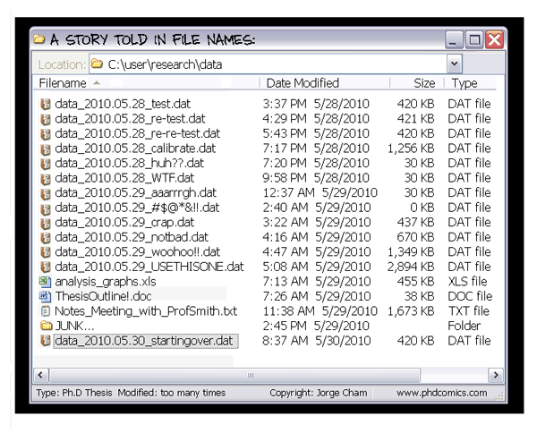
</center>

The video below explains some basic concepts of version control and what the benefits of using it are.

<center>
<iframe src="https://player.vimeo.com/video/41027679" width="500" height="300" frameborder="0" webkitallowfullscreen mozallowfullscreen allowfullscreen></iframe>
<p><a href="https://vimeo.com/41027679">What is VCS? (Git-SCM) &bull; Git Basics #1</a> from <a href="https://vimeo.com/github">GitHub</a> on <a href="https://vimeo.com">Vimeo</a>.</p>
</center>

So to sum up, version control allows to keep track of:

* When you made changes to your files
* Why you made these changes
* What you changed

Additionally, version control:

* Facilitates collaboration with others
* Allows you to keep your code archived in a safe place (the cloud)
* Allows you to go back to previous version of your code
* Allows you to find out what changes broke your code
* Allows you to have experimental branches without breaking your code
* Allows you to keep different versions of your code without having to worry about file names and archiving organization

```{block, type="alert alert-success"}
> **Question 4**: Think of examples where you could use version control for things other than code.
```

The three most popular version control software are **Git**, **Mercurial** (abbreviated as hg) and **Subversion** (abbreviated as svn). *Git* is by far the most modern and popular one, so we will only use *Git* in this course.

## Git 


### What git does 

**Git** keeps track of changes in a **local repository** you set up on your computer. Typically that is a directory that contains all your code and optionally the data your code needs in order to run. The local repository contains all your files, but also (in a hidden directory) all the changes to the files you have made. It does not keep track of all files automatically: you need to tell git which files to track and which not. Therefore a repository contains your current tracked files (**workspace**), an **index** of files that are being tracked, and the version history.

Every time you make significant changes to the files in your workspace, you have to **add** the changed files to the index, which selects the files whose changes you want to save, and **commit** them, which means saving the changes to the history tracking of your local repository.

Often you also setup a **remote repository**, stored on an online platform like [GitHub](https://github.com/), [GitLab](https://gitlab.com) or others. It is simply a remotely-hosted mirror of your local repository and allows you to have your work stored in a safe place and accessible from your other computers and potential collaborators. Once in a while (at the end of the day, or every new commit if you want) you can **push** your commits, which means sending them to the remote repository so it keeps in sync with your local one. When you want to update your local repository based on the content of a remote repository, you have to **pull** the commits from the remote repository.

### Summary of git semantics

+ **add**: Tell git that you want a file or changes to be tracked. These files/changes are not yet saved in the repository! They are listed as "staged" in the index or staging area for the next *commit*.
+ **commit**: Save the *staged* changes to your *local repository*. This is like putting a milestone or taking a snapshot of your project at that moment. A commit describes what has been changed, why and when. In the future you can always revert all tracked files to the state they were at when you created the commit.
+ **push**: Send previous changes you committed to the local repository to the remote repository.
+ **pull**: Update your local repository (and your workspace) with all new stuff from the remote repository. This command is simple, but potentially destructive, since it overwrites your files with the ones in the remote server. Hence it is not available in the Git GUI.
    + **fetch**: Get information about the latest commits from the remote repository, but do not apply them to your local repository automatically. This is always safe as it does not change your workspace.
    + **merge**: Merges two versions (branches) into one, applying the result to the workspace. This includes merging commits from the remote repository with the commits of the local repository. In effect, a **fetch** followed by a **merge** is the same as a **pull**, but it allows you more fine-grained control and is available through the Git GUI.
+ **clone** : Copy the content of a remote repository locally for the first time.
+ more advanced:
    + **branch** : Create a branch (a parallel version of the code in the repository)
    + **checkout**: load the status of a *branch* into your workspace


<center>
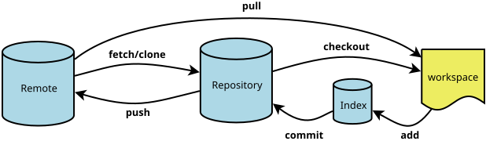
</center>


## Setting up a Git project

Effective use of git includes two components: local software to manage the files on your computer (git client) and an online git hosting service to make them centrally accessible. While git is a single system, there is a variety of clients and a variety of hosts.

In the virtual machine provided for you, we have three clients installed: the command line client (`git`), the basic and a bit old-fashioned Git GUI and a more modern Git Cola.
The choice of client is up to you, and you can try them all out and even mix and match.

In this tutorial, we will cover Git Cola and the command line client.
The command line client is by far the most efficient way to use Git.
Knowing how to use git from the command line is also useful when working on cloud virtual machines/servers for big data processing.
But you need to not be afraid to use the terminal, and know what commands to use.
We have not covered how to use the terminal yet, but for now, you can follow along by opening the Terminal app and entering the given commands into it.

There are more graphical clients as well, including one integrated into RStudio itself, but these clients are outside the scope of this course. Note that Git is language-agnostic, and we will be using it with both R and Python, so it's best to learn the language-neutral GUI, rather than an R-specific GUI.

Throughout the Geoscripting course, for hosting our code, we will be using the university's very own instance of [GitLab](https://git.wur.nl), the most popular self-hosted Git hosting platform.

Let's jump right into it! We will start by making our very own GitLab scripting project from scratch, and also try forking someone else's project.

### Account setup

The first thing we need to do when starting to work with Git on a new device is to create a secure connection between it and the server we will be using to store our repositories.
Git by itself does not handle security, and rather offloads that task to a program called `ssh`, which means **S**ecure **Sh**ell.
SSH is the program you would use to connect to a remote computer using the command line, such as when working on a remote server.
It requires the use of a pair of randomly generated keys to identify each device to each other.

One key is the private key, it can be used to *decrypt* messages sent to your computer.
The private key does not ever leave your computer and is never sent over the network.
The public key is used to *encrypt* messages, and only the private key can be used to decrypt messages encrypted by your public key.

You can think of the keys a bit like your online bank account.
The private key is like the password to log into your online bank (but safer, as it never leaves your computer), whoever has it can use the money in the account.
In contrast, the public key is like your bank account number.
You can post it on your website and in social media, because the only thing that others can do with it is to send money to it.
And if you send money to someone else, they can also use your public account number to verify that the money indeed came from you.

Therefore, the first step is to generate a key pair, and the second step is to register the public key in our Git hosting service (GitLab), so that you link your computer to your account.

1. *Launch your key manager*

You can create the key pair in three ways.
The easiest graphical way to do it is to use the *Passwords and Keys* app.
In Ubuntu, click *Show Apps* at the bottom left and either click on *Utilities* → *Passwords and Keys*, or just start typing *Passwords* in the *type to search* searching bar and hit Enter.


2. *Create an SSH key pair*

Click on the `+` icon at the top left of the *Passwords and Keys* app and select *Secure Shell key*.


Give a description of your device, e.g. "VirtualBox for Geoscripting".
Click *Generate*, and the app will ask you for a passphrase.
A passphrase is an extra layer of security, where if someone manages to obtain your private key, they will not be able to use it without knowing your passphrase.
In other words, it's encryption for your private key.
It's useful to set a passphrase for keys that are on shared computers, because other users will then not be able to read it even if they manage to access the file.
However, if you set a passphrase, you will have to enter it *every time that Git communicates with the server*.
That will get quite annoying very quickly.
Therefore, since you are working on your personal virtual machine, just keep the passphrase field empty.
If someone *does* manage to somehow obtain your private key, you can always simply revoke your public key.

Now double-click on the newly generated key, and click the copy button next to *Public Key*.


```{block, type="alert alert-info"}
**Note**: Passwords and Keys is only available in Linux (GNOME desktop environment). If you want to generate keys on other platforms, use any of the following methods.

The first option is to use *Git GUI*. Git GUI is a graphical interface to Git that is developed together with Git itself, and is thus cross-platform. Windows users can obtain it by simply [downloading git](https://git-scm.com/download/) and installing it to obtain Git GUI.

When launched, it looks something like this:

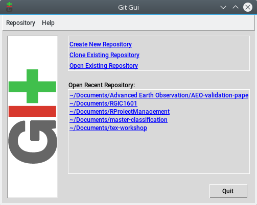

You can generate a new SSH key pair in Git GUI by going to *Help* → *Show SSH Key* and pressing the *Generate Key* button.
Once done, you will see your new public key:

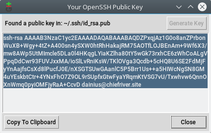

The second option to generate keys is to use the terminal.
This is especially useful if you are using a server without a GUI, or using a different Linux distribution or desktop environment. Simply run the command in the terminal: `ssh-keygen -t rsa -b 4096`

In all cases, by default the public key is stored in the file `~/.ssh/id_rsa.pub` (where `~` indicates the user's home directory).
You can read it from the terminal by running: `cat ~/.ssh/id_rsa.pub`
```

Next, we will link our client with a Git host so that we can download and upload repositories.

3. *Log into GitLab*

Go to [WUR GitLab](https://git.wur.nl/) and log in (using the **WUR Single Sign On** button). 

4. *Enroll the public key to your user account*

The SSH key pair is used to identify that you own the device.
Now you need to tell GitLab about your new key. To do that, in GitLab click on your avatar in the top left and go to *Edit profile* → *SSH keys*. Click *Add new key*, paste the public key in the box, and press *Add key*.

This only has to be done once (per device/OS you use GitLab on).

### Creating a new repository

5. *Create remote repository*

Now we are ready to start making new repositories! In GitLab, press the "+" button at the top left, select *New project/repository* (GitLab uses both terms somewhat interchangeably) and *Create blank project*. Give it a descriptive name and a short description, choose the visibility of the repository and check *Initialize repository with a README*.

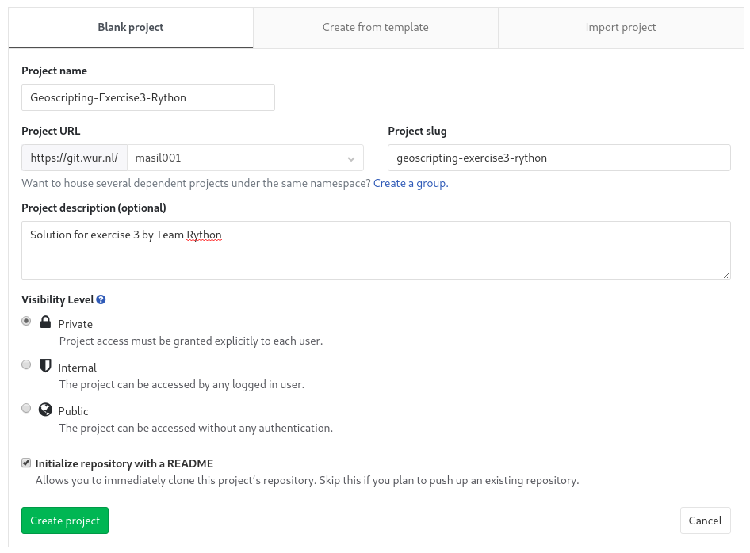

<!--Next, GitHub asks what software license you'd like to apply to your code, as we have discussed in the previous chapter. See [Choose a License](http://choosealicense.com/) for a quick overview of what licenses are available. Make sure to choose a license, otherwise basic copyright applies to your code.

In addition, you can add a `.gitignore` file. This is useful to prevent Git from tracking files that you don't want to keep track of, like temporary files or your R command history. The options are sorted by language, so you can select your language of choice, e.g. `R`.-->

6. *Configure repository settings*

Explore your new blank repository a bit. In the middle, you have buttons to add new files. Choose to add a `LICENSE` file, as we have discussed in the previous chapter. See [Choose a License](http://choosealicense.com/) for a quick overview of what licenses are available. Make sure to choose a license, otherwise basic copyright applies to your code.

On the tabs to the left, you can find that the repository can have issues and merge requests assigned to them. **Issues** is what is used to give feedback on code, so try and make a few issues and close them. It is useful to know how to use these, as for personal projects it can be used as a to-do list, and for others' projects you can use it to report bugs or propose suggestions. You may be surprised how responsive developers can be to newly raised issues!

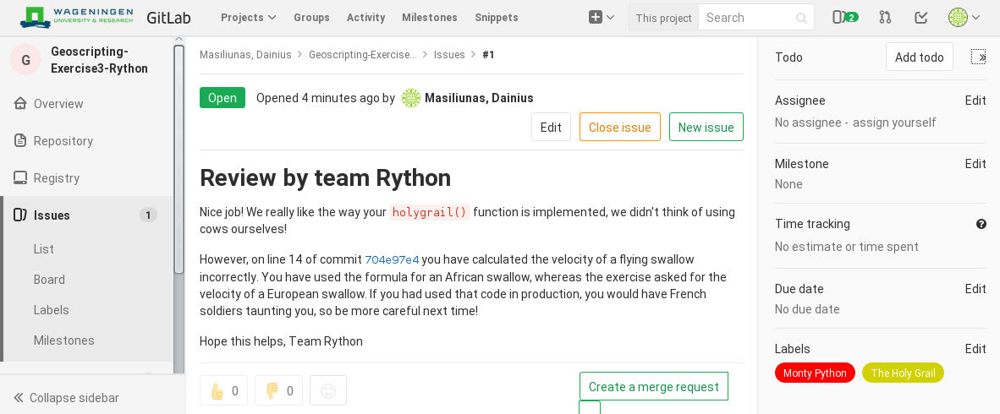

Next, check out the repository settings. Under the *Members* subtab of the *Manage* tab, you can invite other people to collaborate on your repository. Go ahead and invite your team member to be a collaborator with a maintainer role.

<!-- **Note:** During the course you are also required to add a staff member to your project with *Master* privileges before the submission deadline of each exercise in order for your exercise answer to be graded. The username of the staff member you need to add can be found on Blackboard. Do not share the repository with a group. **Submissions that do not follow this rule will be rejected!** -->

7. *Get the URL of your new repository*

Now that you have a remote repository, it's time to create a local repository that links to it! Open the main page of your new repository, click the blue *Code* button at the top right of the your repository page, and copy the *Clone with **SSH** * address of your new repository.

<!-- 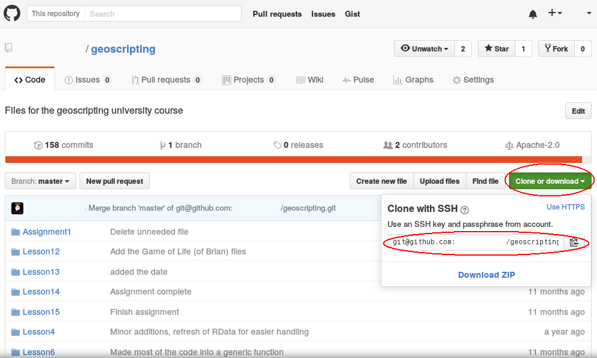 -->
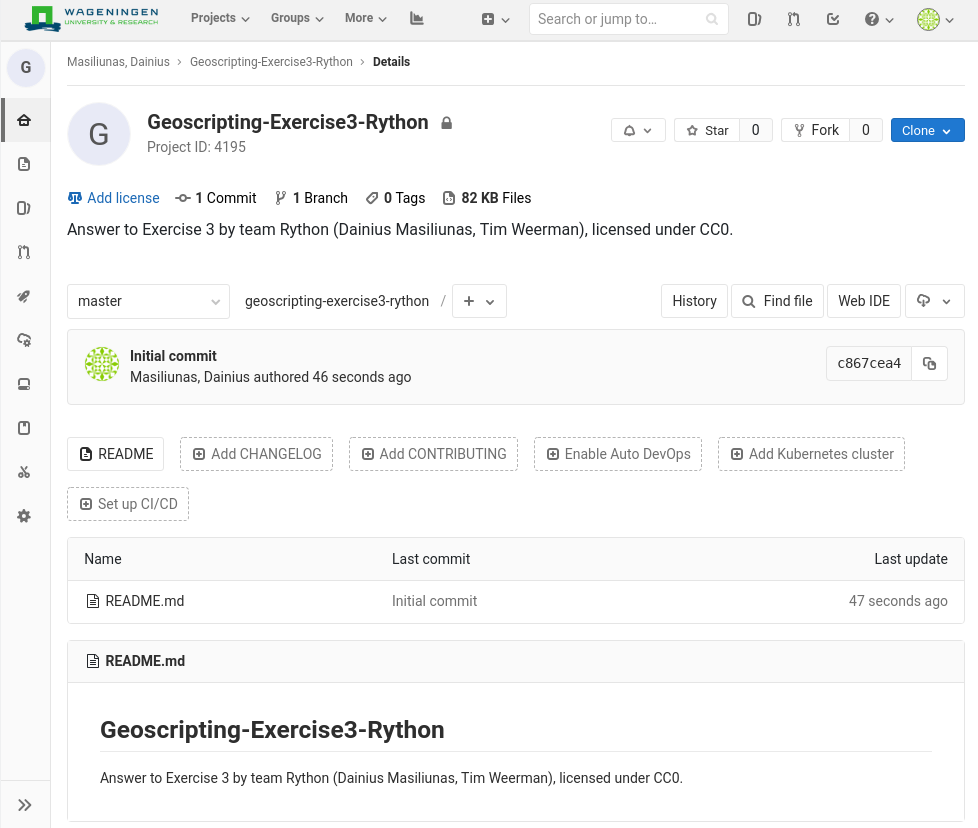

8. *Clone your repository*

Let's first clone the repository using the *Git Cola* app.
Open it from *Show Apps* at the bottom left of the Ubuntu.
Press *Clone...* in *Git Cola* and paste the link you just copied into the box.
Press *Clone* and select the directory you want to put the repository into.
A subdirectory with the name of the repository will be created for you.
After pressing *Open*, you will get a question about whether you trust the remote machine.
You need to answer this with `yes` (the full word). This puts the GitLab server into a list of trusted servers, to guard against potential impostor servers.

You will end up in an empty Git Cola window:


From the terminal, the same can be achieved with the `git clone` command (it will clone in your working directory, by default your user directory `~`), for example:
```bash
git clone git@git.wur.nl:masil001/geoscripting-git-test.git
```

The repository will be cloned into a subdirectory with a matching name. This is much faster than using any GUI!

```{block, type="alert alert-info"}
To clone using Git GUI, press *Clone Existing Repository*. Paste the URL you just copied to the *Source Location* field, and choose a directory you want to store your code in in the *Target Directory* field. **Note**: unlike in Git Cola, the *Target Directory* must **not** already exist! Git GUI will create it for you.

You will end up in an empty Git GUI window:

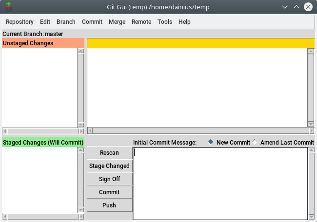
```

```{block, type="alert alert-danger"}
**Notice**: Sometimes Git GUI crashes or gets stuck at this stage. When you restart it, you may also find that the panes are collapsed (you need to drag them out from the borders of the window) and that the repository branch is set to `master` instead of `main`. To avoid this issue, and because it is much faster and more convenient in general, we recommend always cloning repositories from Git Cola or the terminal.
```

9. *Tell Git who you are*

Before you start using Git, you should tell it what your name and email address is. You need to do that only once per Git installation. You should go to *File* → *Preferences* in Git Cola (in Git GUI it's *Edit* → *Options...*) and fill out the options *User Name* and *Email Address* under *All Repositories* . These will be displayed in GitLab.

You can also do that from the terminal:

```bash
git config --global user.name "Your Name"
git config --global user.email you@example.com
```

### Working with Git Cola

10. *Make changes*

To see Git in action, you need to make some changes in your repository. Try it by creating a new file in the directory where you cloned your new project. You can do that using the *Text editor* (gedit), or from the terminal using the `touch` and `nano` command.

Let's go back to Git Cola. If you closed the previous Git Cola window, you can get back to your repository by launching Git Cola and clicking on its path in the *list*. You will see some changes:


To see a list of files with pending changes from the command line, use `git status` while in a git repository directory. To see what exactly changed in each of these files, use `git diff`. For example:

```bash
# Go into our repository we just cloned
cd geoscripting-git-test/
# Get list of changed files
git status
```

```{block, type="alert alert-info"}
Git GUI works equivalent to Git Cola, only that you need to press the *Rescan* button every time you want it to reload the list:

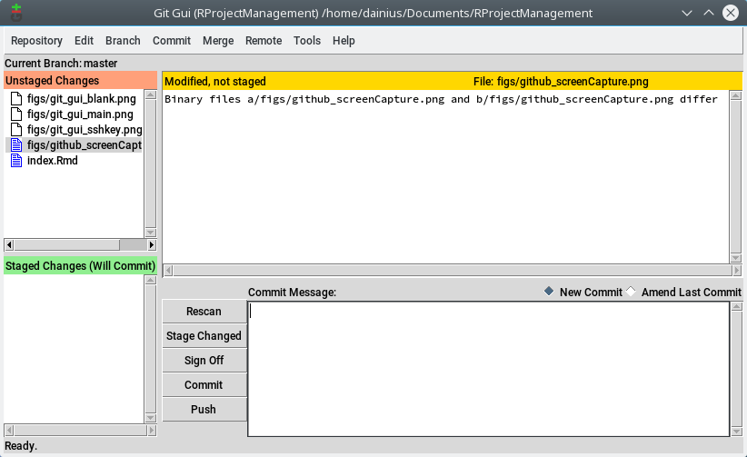
```

11. *Stage changes*

At the top left corner of Git Cola (or similar in Git GUI), the *Status* panel, you can see all the files that changed in your workspace. If you click on the name of the file, the *Diff* panel will show you what changed in that file since the last commit. Unless it is a non-text (data) file, in which case it will just note that something has changed. **Note** that Git is very efficient with storing changes in text files: these *diff* files are all it stores internally, it does not copy the whole file on each commit. However, it does not deal efficiently with non-text files, and thus you should limit the amount and size of such files as much as possible.

If you double-click on the name of the file in the *Untracked* category, the file changes will be *staged* and appear at the *Staged* category. These are the file changes you want to save and sent to GitLab. You don't have to stage all files for each commit, only those you actually want to be tracked by git. You can safely ignore some files such as manual backups, temporary files, and the like and they will remain untracked by git, as long as you never stage them. If you do want to stage everything, you can press the *Commit* → *Stage Modified* button. If you staged more than you wanted to, you can double-click on the file in the *Staged* panel to unstage it.

To stage a change from the command line, use `git add` and a path to the file to stage To unstage, use `git restore --staged` and a path to the filename. For example:

```bash
# Stage
git add hello.txt
# Unstage
git restore --staged hello.txt
```

```{block, type="alert alert-info"}
Git GUI works similarly to Git Cola, but clicking the **name** of the file shows the changes you made, clicking the **icon** of the file stages or unstages the change.

**Tip**: If you have files that you don't want git to track, you can add them into the `.gitignore` file. It could be the name of a file, a directory, a wildcard (e.g. `*.pdf`), or any combination of these. To list several, put them on separate lines.
```

12. *Commit changes*

Once you staged the files that you want to commit, you need to fill out the *commit message*. This is a brief description of what changes you made between the last commit and the one you are about to create. The **top line** (commit summary) is the **title** of the commit, keep that one short. Subsequent lines (extended description) are the **description**. You may notice that there is a character counter at the top right which goes yellow if you exceed 65 characters on a line. that is intentional, because your commit message should fit within 65 characters per line for easy reading on the terminal. Use new lines to break longer sentences or paragraphs.

If it is the first time you use Git Cola to make a commit, and you haven't filled out your user name and email, it might complain about it not knowing who you are. In that case go back to step 9.

Next press the *Commit* button and your commit will be saved locally. A commit is like a saved state: you are always able to roll back the contents of your tracked files to the state they were in when you committed the changes.

To commit a change from the command line, use `git commit`. It will start a command line text editor so that you can write a commit message. If you want to stage all tracked and changed files and commit all in one step, use `git commit -a`. To include a message with your commit without using a text editor, you can use the commit command with the `-m` flag, for example:

```bash
git commit -m "Add a new file hello.txt"
```


```{block, type="alert alert-info"}
Git GUI works similarly, but the commit box is not separated into title and description. Rather, the title is the first line, and the subsequent lines are the description. The textbox is limited to 65 characters in width and has no scrollbar.
```

```{block, type="alert alert-success"}
> **Question 5**: What's the difference between stage difference and commit changes in git?
```


13. *Push changes to the server*

Select *Actions* → *Push*, and confirm the push, to send all your changes to your GitLab repository. You can now refresh the GitLab page to see your changes. Well done!

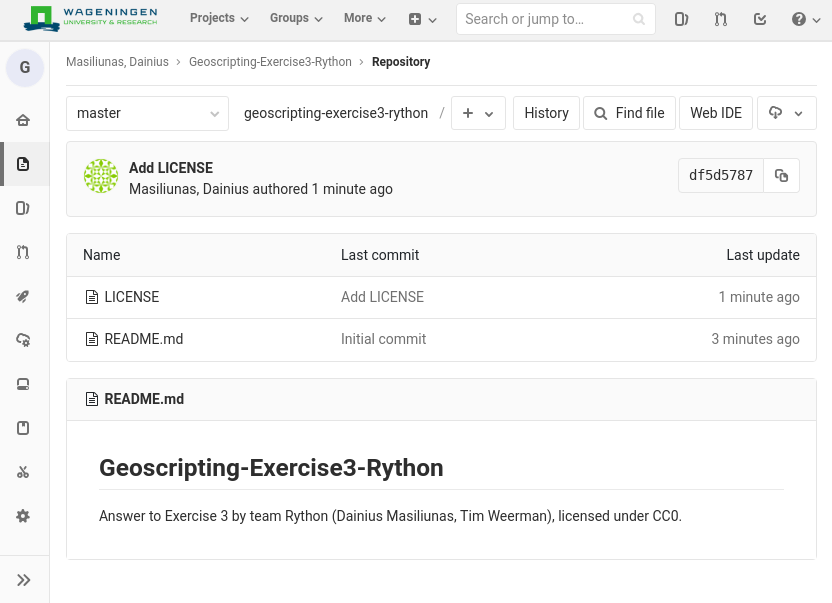

To push changes from the command line, type `git push`.

14. *Pull changes from the server*

One of the major uses of Git is collaboration and the ability to synchronise changes across different devices. Multiple users can do changes in the same Git repository (as long as you change the repository settings in GitLab to allow another user to do that), and you can work on the same code on different devices yourself. In both cases, it is important to keep all local repositories in sync with the remote repository. That is done via Git Cola by using *Actions* → *Pull*.

If you like, you can test it by cloning the same repository in another directory, making changes and pushing them to the server, then using pull in the other copy. If all goes well, the changes in the server will be applied to your local repository files.

You can do the same on the command line with `git pull`.

```{block, type="alert alert-info"}
In Git GUI, it is slightly more complicated, as there is no pull button. Rather, a pull is a combination of a fetch and a merge. Therefore, you need to first do *Remote* → *Fetch from* → *origin*, followed by a  *Merge* → *Local merge...*.
```

There may be cases where files go out of sync in incompatible ways, however, like two people editing one file at the same time. In that case you may hit a *merge conflict*. You will see a message such as:

```
From git.wur.nl:masil001/geoscripting-git-test
   9179eca..6b7ea60  main       -> origin/main
hint: Diverging branches can't be fast-forwarded, you need to either:
hint: 
hint: 	git merge --no-ff
hint: 
hint: or:
hint: 
hint: 	git rebase
hint: 
hint: Disable this message with "git config advice.diverging false"
fatal: Not possible to fast-forward, aborting.
```

It is best to try to avoid them. In case it happens, you need to first try to merge the changes. Go to *Actions* →  *Merge* and select *Tracking branch*, *origin/main*. You will get another error message, such as:

```
Auto-merging hello.txt
CONFLICT (content): Merge conflict in hello.txt
Automatic merge failed; fix conflicts and then commit the result.
```

Now open the file(s) that are mentioned in the message in a text editor and edit them by hand, keeping the parts of the files you need. The conflicting parts will be in between lines of of `>>>>`, `====` and `<<<<` symbols. Once you remove the parts you don't need (including the separators), you can solve the conflict by committing the changed files.
The title of the commit will be made automatically.
After committing, it will allow you to push the resolved changes back to GitLab.

### Forks and merge requests

Now we know how to work with Git and GitLab for our personal work, and how to collaborate on a project with your team member. But what if you want to contribute code to someone else who has not given you access rights, or what if you want to review the code before it's accepted to your repository? That's where forking and merge requests come in handy (respectively)!

A fork is your own personal copy of someone else's repository. GitLab allows you to fork any public repository. You want to make forks whenever you want to edit code but do not have direct commit rights.

```{block, type="alert alert-info"}
**Tip**: In fact, if you click the edit button on a file on GitLab and do changes to a repository that you don't have the rights to write into, GitLab will helpfully make a fork for you, followed by a proposal to make a merge request for your changes.
```

15. *Fork a repository*

Go to your team member's repository that they created by following the steps above, and then click the *Fork* button at the top right. (If you can't find it, alternatively you can go to some other repository, and fork it.) You will find a new repository under your profile, by default with the same name as the original.

<!--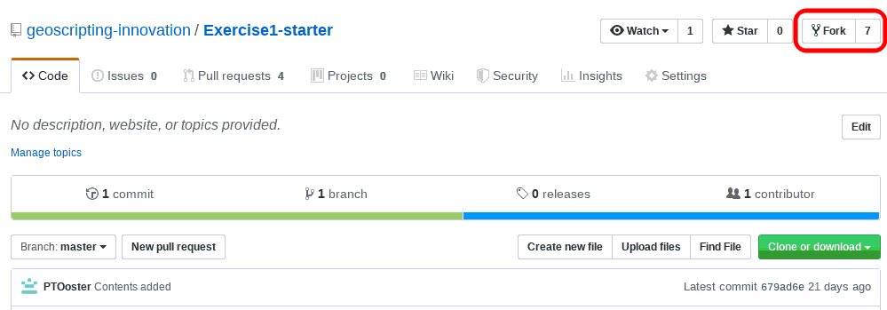-->

16. *Make changes, commit and push*

After you have your own fork, it is the same as having your own personal repository with the code from the original (*upstream*) repository in it. Clone it locally, make some changes, commit them and push them back to GitLab, as per steps 7-10. You should see that your changes take effect in your own *downsteam* fork, but not in the upstream repository.

17. *Make a merge request*

If you are ready to ask the upstream developers to incorporate your code into their repository, go to the *Code* → *Merge Requests* tab and press the blue *New merge request* button. Select your `main` branch of your fork as the source.

<!-- 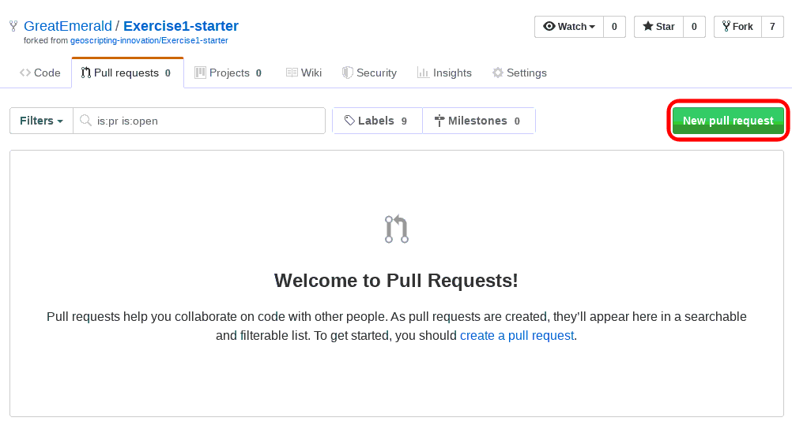 -->

This will show you all the changes you have made, and if that is what you want to propose for the upstream developers to incorporate, give the name for your merge request (changeset) and a description as to why the upstream developers would want to incorporate your code. After you confirm clicking *Create merge request*, the merge request will be visible in the merge requests tab of the *upstream* repository:

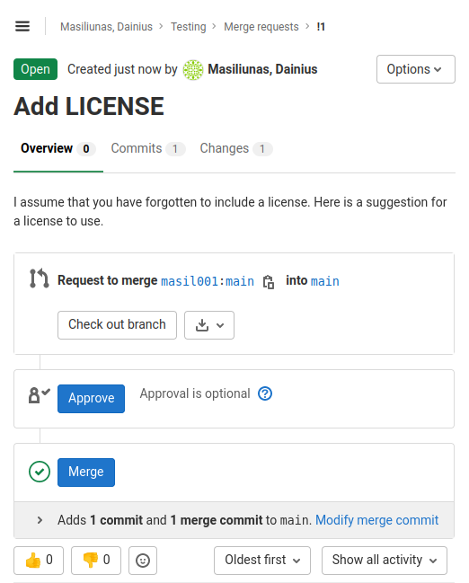

Then it's up to the upstream developers to perform a code review and either accept or reject the pull request in the end.

```{block, type="alert alert-info"}
**Tip**: For code review, GitLab also has special tools. If you look at the *Changes* tab of a merge request, you will see that you can press a bubble button next to any line of code and write a comment about it. Once finished, there is a "Submit review" button at the bottom to send all comments at once.
```

### Other Git Cola functionality

You might run into a situation when you have made changes in tracked files, but do not want to keep some of the changes. You can revert one file by right-clicking on it and selecting *Revert Unstaged Edits...*.

The command line equivalent is `git checkout \-\- path/to/file.ext`, or if you want to reset all changed files, `git reset \-\-hard`.

Git Cola not only provides a way to make, push and pull commits, but also to visualise the commit history of your repository in a tree graph. There are two ways to do it. The first is to go to *Branch* → *Visualise Current Branch...*. For larger and more complex projects with lots of contributors and merges, it might look like some sort of a subway map:

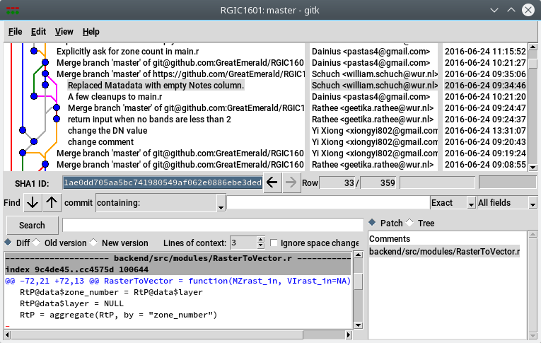

This visualisation tool is called `gitk` and is the same (old-fashioned) tools that Git GUI uses as well. There is a slightly more fancy way to visualise history in Git Cola by going to *View* → *DAG...*, which also shows the history as a clickable dynamic graph.

The history view also allows you to reset the state of the repository to any previous commit by using the context menu. Note, however, that you can only push if you are on the latest commit. So the easiest way to revert changes is to copy over the files to a temporary directory outside of git, reset back, and move the files back into your repository.

The command line equivalent is `git log`, though it does not show a graph view. You can also run `gitk` from the terminal directly. A few more options are available from the command line. `git revert <commit>` will undo changes from a given commit, where `<commit>` is the commit ID (you can get commit IDs from `git log`, they look like a long string of letters and numbers). `git checkout <commit> \-\- path/to/file.ext` will reset a single file to the state it was at the given commit.

You can also browse the history of a repository from your Git hosting service, and GitHub/GitLab even allow editing files from a web interface.

```{block, type="alert alert-success"}
> **Question 6**: How do you find commit history and old versions of your files on GitHub/GitLab?
```

Below you can see a visual summary of what we have described above. 


That's it: now you know how to keep track of all your files, so you will never lose them again, and no longer have to worry about making backups or saving multiple versions. In addition, this is the way that free and open-source code development happens in actuality. Also, the exercises and assignments in the course will be delivered and submitted this way, so make sure you are familiar with the whole process!

# Generative AI in coding
**TODO: ADD MORE ABOUT COPILOT**
Another type of online resource that has recently been gaining in popularity is generative AI, such as ChatGPT. Generative AI models can be interacted with by asking it questions, including questions about programming. The AI responds by providing examples of code, explanations about what the code does, and how to run it. Of course, most AI solutions are not limited to code and will also answer questions on history, biology, quantum mechanics, and will even play Dungeons and Dragons with you, including throwing dice.

Generative AI models can be a great tool to enhance learning, as they can quickly answer specific questions and give coding suggestions. However, many of the limitations of web search apply to generative AI models as well (in fact, most of these models are something of a smart web search engine, as they are trained on a lot of text found on the internet). Therefore, you need to be very critical of AI-generated answers. The code that the AI generates may seem like it would solve your problem, but it may also do something incorrectly, such as calling functions that are no longer available, or even making them up altogether. Previously, many generative AI solutions were unable to provide references for their statements, and when asked provided a list of references and links that did not exist in reality, though this has improved in the past months. They may also answer questions completely wrong, but the explanation that they provide usually sounds quite convincing, therefore it may mislead you or make you second-guess yourself. When generative AI models are confronted about a wrong answer, they often insist that it is correct, and the longer you talk with a generative AI, the more it will get facts mixed up with its own previous answers, as it remembers and learns from its own output.

Generative AI tools can be chatbots, like ChatGPT, but they can also be tools that suggest code snippets as you write code, such as GitHub Copilot. The AI code suggestions are based on the same models and have the same pitfalls. But in addition, they may suggest code that was taken from software whose license is incompatible with the license of your own code, which could cause copyright issues. Some of the newer code suggestion models are able to provide references to where the code is sourced from, and the license it is under.

Some of the currently active generative AI tools are:

* [ChatGPT](https://chat.openai.com/) - the original chatbot that started the generative AI trend. Made by a team of top AI researchers that formed into a company. The newest version, ChatGPT-4 is able to provide sources and references if you specify this in the prompt. It also allows the usage of custom GPTs, better suited to specific tasks, like the Python and R Wizard GPTs.
* [Perplexity](https://perplexity.ai/) - an alternative chatbot built using ChatGPT-4o and [Anthropic's Claude 3.5](https://www.anthropic.com/claude) models that is able to provide references for its statements (and you can even pick which ones it uses to give you answers). However, it still gives biased output and may get confused with its own answers.
* [Microsoft Copilot](https://www.bing.com/?/ai) - Microsoft's version of ChatGPT, also built on the ChatGPT-4 framework. It can also provide references for you if you ask. It generally allows you to access the newest version of ChatGPT for free, instead of having to pay for GPT Plus on the ChatGPT website.
* [Google Gemini](https://bard.google.com/) - Google's version of ChatGPT. It has recently improved a lot compared to Google's older models. Will also provide sources or references, if you ask for it. Can integrate with your Google Workspace (Gmail, Drive, YouTube), for example, it's a great way to summarize a YouTube tutorial into bulletpoints or clear steps.
* [Amazon Codewhisperer](https://aws.amazon.com/codewhisperer/) - code suggestion AI, free to use, but works only with some code editors.

Note that all of these generative AI tools are built on proprietary models, but there are open source alternatives such as [Meta's Llama 3.1](https://llama.meta.com/) that you can use for your own applications. 

Every day, more generative AI tools become available, increasingly embedded in the tools we use, like Google Gemini replacing 'Ok Google' on your phone and some web-browsers shipping with built-in models, like Brave browser shipping with Leo AI based on [MistralAI's Mixtral model](https://mistral.ai/technology/#models). Despite the fact that generative AI is increasingly embedded, it remains important to check whether the results it provides are factual, accurate and if the output is compatible with the license of your own code.


# References

* Great 15 min interactive git commands tutorial: [try.github.io](https://try.github.io)
* Hadley Wickham on [Rstudio and git](http://r-pkgs.had.co.nz/git.html#undefined)
* R Studio documentation on version control: [Using Version Control with RStudio](http://www.rstudio.com/ide/docs/version_control/overview)
* Video tutorial to use revision control with R Studio and GitHub/BitBucket [Youtube link](http://www.youtube.com/watch?v=jGeCCxdZsDQ&noredirect=1)
* Advanced Git: [A successful git branching model](http://nvie.com/posts/a-successful-git-branching-model/)
