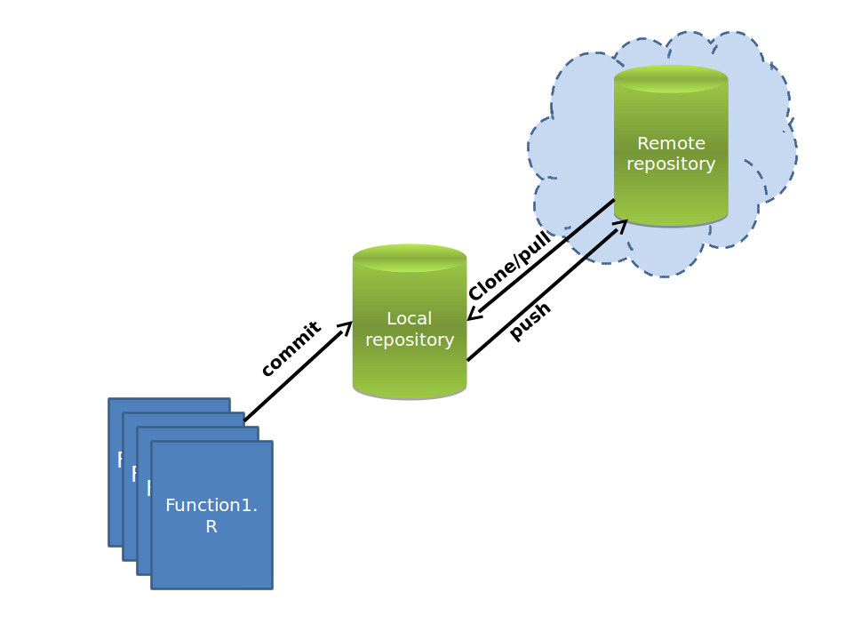

# Today's learning objectives
At the end of the lecture, you should be able to


* Find help for R related issues
* Produce a reproducible example
* Adopt some good scripting/programming habits
* Use control flow for efficient function writing
* Make efficient use of RStudio projects
* Use version control to develop, maintain, and share with others your R packages

**The two last points are particularly important, so try to go quickly over the first part of the tutorial and spend more time on projects and version control**

# Introduction

During the previous lecture, you saw some general aspects of the R language, such as an introduction to the syntax, object classes, reading of external data and function writing. Today the emphasis of the lecture is mostly oriented toward carrying an R project. Therefore, some recurrent aspects of project development, such as, how to find help, or techniques to organize your code and your projects are covered in the lecture.
Scripting means that you often go beyond easy things and therefore face challenges; as a consequence, it is likely that at one moment or another, you will have to go look for help. Part of this lesson is intended to guide you through ways of finding help, including posting to the mail list and writing a reproducible example. In addition, this lecture goes through a couple of essential ''good practices'' when working on geo-scripting projects. Not all aspects of good practices are covered, however, for those of you who are curious to know more about version control, R package building, etc, be sure to check the reference section of this document.


# Finding help

There are many place where help can be found on the internet. So in case the function or package documentation is not sufficient for what you are trying to achieve, google is your best friend. Most likely by googling the right key words relating to your ''problem'', google will direct you to the archive of the R mailing list, or to some discussions on [Stack Exchange](http://stackexchange.com/). These two are reliable sources of information, and it is quite likely that the problem you are trying to figure out has already been answered before.

However, it may also happen that you discover a ''bug'' or something that you would qualify of abnormal behavior, or that you really have a question that no-one has ever asked (corollary: has never been answered). In that case, you may submit a question to one of the R mailing list. For general R question there is a general [R mailing list](https://stat.ethz.ch/mailman/listinfo/r-help), while the spatial domain has its own mailing list ( [R SIG GEO](https://stat.ethz.ch/mailman/listinfo/r-sig-geo) ). Geo related question should be posted to this latter mailing list.


Warning, these mailing list have heavy mail traffic, use your mail client efficiently and set filters, otherwise it will quickly bother you.


These mailing lists have a few rules, and it's important to respect them in order to ensure that:


* no-one gets offended by your question,
* people who are able to answer the question are actually willing to do so,
* you get the best quality answer


So, when posting to the mail list: 


* Be courteous,
* Provide a brief description of the problem and why you are trying to do that.
* Provide a reproducible example that illustrate the problem, reproducing the eventual error
* Sign with your name and your affiliation
* Do not expect an immediate answer (although well presented question often get answered fairly quickly)


# Creating a reproducible example

Indispensable when asking a question to the online community, being able to write a reproducible example has many advantages.
First it may ensure that when you present a problem, people are able to answer your question without guessing what you are trying to do. But reproducible examples are not only to ask questions; they may help you in your thinking, developing  or debugging process when writing your own functions. For instance, when developing a function to do a certain type of raster calculation, start by testing it on a small auto-generated rasterLayer object, and not directly on your actual data covering the entire universe 
dots

## But what is a reproducible example exactly?

Well, one could define a reproducible example by a piece of code that can be executed by anyone who has R, independently of the data present on his machine or any preloaded variables. The computation time should not exceed a few seconds and if the code automatically downloads data, the data volume should be as small as possible.
So basically, if you can quickly start a R session on your neighbour's computer while he is on a break, copy-paste the code without making any adjustments and see almost immediately what you want to demonstrate; congratulation, you have created a reproducible example.

Let's illustrate this by an example.
I want to perform values replacements of one raster layer, based on the values of another raster Layer. (We haven't covered raster analysis in R as part of the course yet, but you will quickly understand that for certain operations rasters are analog to vectors of values).

```{r, fig.align='center'}
# Create two rastersLayer objects of similar extent
library(raster)
r <- s <- raster(ncol=50, nrow=50)
# fill the raster with values
r[] <- 1:ncell(r)
s[] <- 2 * (1:ncell(s))
s[200:400] <- 150
s[50:150] <- 151
# perform the replacement
r[s %in% c(150, 151)] <- NA
# Visualize the result
plot(r)
```


Useful to know when writing a reproducible example; instead of generating your own small datasets (vectors or RasterLayers, etc) as part of your reproducible example, use some of R ''built-in'' datasets. They are part of the main R packages.
Some popular datasets are: `cars`, `meuse.grid_ll`, `Rlogo`, `iris`, etc
The [auto completion](http://en.wikipedia.org/wiki/Autocomplete) menu of the `data()` function will give you an overview of the datasets available. (In RStudio like in most script editing environments autocompletion can be toggled by pressing the tab key, use it without moderation.)

```{r, echo=TRUE, fig.align='center'}
# Imports the variable cars in the working environment
data(cars) 
class(cars)
# Visualizes the first six rows of the variable
head(cars)
# The plot function on this type of dataset (class = data.frame, 2 column)
# automatically generates a scatterplot
plot(cars)
```

Another famous data set is the meuse data set, providing all sorts of spatial variables spread across a part of the meuse watershed.
The following example compiled from the help pages of the sp package.

```{r}
## Example using built-in dataset from the sp package
library(sp)
# Load required datastes
data(meuse)
# The meuse dataset is not by default a spatial object
# but its x, y coordinates are part of the data.frame
class(meuse)
coordinates(meuse) <- c("x", "y")
class(meuse)
```

Now that the object belongs to a spatial class, we can plot it using one of the vector plotting function of the sp package. See the resulting in the figure below.

```{r, echo=TRUE, fig.align='center'}
bubble(meuse, "zinc", maxsize = 2.5,
       main = "zic concentrations (ppm)", key.entries = 2^(-1:4))
```

The sp package help page contain multiple examples of how to explore its meuse built-in data set. Another example of multiple plots using `meuse.grid` is given in the figure below.

```{r, echo=TRUE, fig=TRUE, fig.align='center'}
# Load meuse.riv dataset
data(meuse.riv)
# Create an object of class spatialPolygons from meuse.riv
meuse.sr <- SpatialPolygons(list(Polygons(list(Polygon(meuse.riv)),"meuse.riv")))
# Load the meuse.grid dataset
data(meuse.grid)
# Assign coordinates to the dataset and make it a grid
coordinates(meuse.grid) = c("x", "y")
gridded(meuse.grid) = TRUE
# Plot all variables of the meuse.grid dataset in a multiple window spplot
spplot(meuse.grid, col.regions=bpy.colors(), main = "meuse.grid",
       sp.layout=list(
           list("sp.polygons", meuse.sr),
           list("sp.points", meuse, pch="+", col="black")
           )
       )
```


# Good scripting/programming habits

Increasing your scripting/programming efficiency goes through adopting good scripting habits. Following a couple of guidelines will ensure that your work:

* Can be understood and used by others
* Can be understood and reused by you in the future
* Can be debugged with minimal efforts
* Can be re-used across different projects
* Is easily accessible by others
  

  
In order to achieve these objectives, you should try to follow a few good practices. The list below is not exhaustive, but already constitutes a good basis that will help you getting more efficient now and in the future when working on R projects.


* Write short functions.
* Make your functions generic and flexible, using **control flow**
* Comment your code
* Follow the R [style guide](http://google-styleguide.googlecode.com/svn/trunk/Rguide.xml) (The aim of having a formatted style guide is to increase readability of your code by others. In that regard, indentation, use of <- instead of = as assignment operator and placement of curly braces are of particular relevance when writing functions. Proper configuration of your script editor allows you to automatically implement some of these guidelines without having to think too much about it.)
* Document your functions
* Build packages
* Work with projects
* Keep a similar directory structure across your projects
* Use **version control** to develop/maintain your projects and packages

Note that the RStudio IDE makes a lot of these good practices a lot easier and you should try to take maximum advantage of it. Take a moment to explore the menus of the RStudio session that should already be open on your machine. Particular emphasis will be given later in this tutorial on projects, project structure and use of version control.

Below is an example of a function written with good practices and without.
First the good example:

```{r}
ageCalculator <- function(x) {
    # Function to calculate age from birth year
    # x (numeric) is the year you were born
    if(!is.numeric(x)) {
        stop("x must be of class numeric")
    } else { # x is numeric
        # Get today's date
        date <- Sys.Date()
        # extract year from date and substract
        year <- as.numeric(format(date, "%Y"))
        if(year <= x) {
            stop("You aren't born yet")
        }
        age <- year - x
    }
    return(age)
}

ageCalculator(1985)
```

29, what a beautiful age for learning geo scripting.

Then the bad example:

```{r}
# DON'T DO THAT, BAD EXAMPLE!!!
funTest_4 <- function(x) {
if(!is.numeric(x)) {
stop("x must be of class numeric")
}
else {
a = Sys.Date()
b <- as.numeric(format(a, "%Y"))
b - x
}
}

funTest_4(1985)
```
It also works, but which of the two is the easiest to read, understand, and modify if needed? ... Exactly, the first one.
So let's look back at the examples and identify some differences:

* Function name: Not very self descriptive in the second example
* Function description: Missing in the second example
* Arguments description: Missing in the second example
* Comments: The second example has none (Okay, the first one really has a lot, but that's for the example)
* Variables naming: use of `a` and `b` not very self descriptive in second example
* Indentation: Missing in the second example
* Control flow: Second example does not check for irrealistic dates

You haven't fully understood what is control flow or are not fully comfortable with functions writing yet? We'll see more of that in the following sections. 

## Function writing

The objective of this section is to provide a few advice to help you write efficiently function. That is functions that are simple, generic and flexible, so that they integrate well in a processing/analysis chain and can easily be re-used in a slightly different chain if needed.
More flexibility in your function can be achieved thanks to some easy tricks provided by control flow. The following section develops further this concept and provides examples of how control flow can help your functions becoming more flexible.

## Control flow
Control flow refers to the use of conditions in your code that redirect the flow to different directions depending on variables values or class. Make use of that in your code, as this will make your functions more flexible and generic.

## Object classes and Control flow
You have seen in a previous lesson already that every variable in your R working environment belongs to a class. You can take advantage of that, using control flow, to make your functions more flexible.

A quick reminder on classes

```{r}
# 5 different objects belonging to 5 different classes
a <- 12
class(a)

b <- "I have a class too"
class(b)

library(raster)
c <- raster(ncol=10, nrow=10)
class(c)

d <- stack(c, c)
class(d)

e <- brick(d)
class(e)
```

### Controlling the class of input variables of a function

One way of making function more auto-adaptive is by adding checks of the input variables. Using object class can greatly simplify this task.
For example let's imagine that you just wrote a simple HelloWorld function.

```{r}
HelloWorld <- function (x) {
    hello <- sprintf('Hello %s', x)
    return(hello)
}

# Let's test it
HelloWorld('john')
```

Obviously, the user is expected to pass an object of character vector to x. Otherwise the function will return an error. You can make it not crash by controlling the class of the input variable.
For example.

```{r}
HelloWorld <- function (x) {
    if (is.character(x)) {
      hello <- sprintf('Hello %s', x)
    } else {
      hello <- warning('Object of class character expected for x')
    }
    return(hello)
}

HelloWorld(21)

```

The function does not crash anymore, but returns a warning instead.

Note that most common object classes have their own logical function, that returns `TRUE` or `FALSE`.
For example.

```{r}
is.character('john')
# is equivalent to 
class('john') == 'character'

is.character(32)
is.numeric(32)
```

You should always try to take maximum advantage of these small utilities and check for classes and properties of your objects.


Also note that `is.character(32) == TRUE` is equivalent to `is.character(32)`. Therefore when checking logical arguments, you don't need to use the `== TRUE`. As an example, a function may have an argument (`plot`) that, if set to `TRUE` will generate a plot, and if set to `FALSE` does not generate a plot. It means that the function certainly contains an if statement. `if(plot)` in that case is equivalent to `if(plot == TRUE)`, it's just shorter.


An example, with a function that subtracts 2 RasterLayers, with the option to plot the resulting RasterLayer, or not.

```{r}
library(raster)
# Function to substract 2 rasterLayers
minusRaster <- function(x, y, plot=FALSE) { 
    z <- x - y
    if (plot) {
        plot(z)
    }
    return(z)
}

# Let's generate 2 rasters 
# that first one is the R logo raster
# converted to the raster package file format.
r <- raster(system.file("external/rlogo.grd", package="raster")) 
# The second RasterLayer is calqued from the initial RasterLayer in order
# to avoid issues of non matching extent or resolution, etc
r2 <- r 
# Filling the rasterLayer with new values.
# The /10 simply makes the result more spectacular
r2[] <- (1:ncell(r2)) / 10
# simply performs the calculation
r3 <- minusRaster(r, r2) 
```


```{r}
# Now performs the claculation and plots the resulting RasterLayer
r4 <- minusRaster(r, r2, plot=TRUE) 
```


### Use of `try` and debugging your functions

#### Use of try for error handling


The `try()` function may help you writing functions that do not crash whenever they encounter an unknown of any kind. Anything (sub-function, piece of code) that is wrapped into `try()` will not interrupt the bigger function that contains `try()`. So for instance, this is useful if you want to apply a function sequentially but independently over a large set of raster files, and you already know that some of the files are corrupted and might return an error. By wrapping your function into `try()` you allow the overall process to continue until its end, regardless of the success of individual layers. So `try()` is a perfect way to deal with heterogeneous/unpredictable input data.


Also `try()` returns an object of different class when it fails. You can take advantage of that at a later stage of your processing chain to make your function more adaptive.
See the example below that illustrate the use of `try()` for sequentially calculating frequency on a list of auto-generated RasterLayers.

```{r, eval=TRUE, echo=TRUE}
library(raster)

# Create a raster layer and fill it with "randomly" generated integer values
a <- raster(nrow=50, ncol=50)
a[] <- floor(rnorm(n=ncell(a)))

# The freq() function returns the frequency of a certain value in a RasterLayer
# We want to know how many times the value -2 is present in the RasterLayer
freq(a, value=-2)

# Let's imagine that you want to run this function over a whole list of RasterLayer
# but some elements of the list are impredictibly corrupted
# so the list looks as follows
b <- a
c <- NA
list <- c(a,b,c)
# In that case, b and a are raster layers, c is ''corrupted''
```

```{r, eval=FALSE, echo=TRUE}
# Running freq(c) would return an error and crash the whole process
out <- list()
for(i in 1:length(list)) {
    out[i] <- freq(list[[i]], value=-2)
}
```

```{r, eval=TRUE, echo=TRUE}
# Therefore by building a function that includes a try()
# we are able to catch the error
# allowing the process to continue despite missing/corrupted data.
fun <- function(x, value) {
    tr <- try(freq(x=x, value=value), silent=TRUE)
    if (class(tr) == 'try-error') {
        return('This object returned an error')
    } else {
        return(tr)
    }
}

# Let's try to run the loop again
out <- list()
for(i in 1:length(list)) {
    out[i] <- fun(list[[i]], value=-2)
}
out

# Note that using a function of the apply family would be a more
# elegant/shorter way to obtain the same result
(out <- sapply(X=list, FUN=fun, value=-2))

```


#### Function debugging

Debugging a single line of code is usually relatively easy; simply double checking the classes of all input arguments often gives good pointers to why the line crashes. But when writing more complicated functions where objects created within the function are reused later on in that same function or in a nested function, it is easy to lose track of what is happening, and debugging can then become a nightmare. A few tricks can be used to make that process less painful. The first thing to investigate right after an error occurs is to run the `traceback()` function; just like that without arguments. Carefully reading the return of that function will tell you where exactly in your function the error occurred. In addition to `traceback()`, R has a more elaborated debugging mode that can be activated by calling `debug()`. Although the use of `debug()` is not covered in this lesson, fell free to explore by yourself these debugging functionalities. Refer to the reference section of this document for further information on function debugging. Aditionnaly RStudio can make your debugging process easier thanks to its integrated debugging tools.


## Working with projects
*Pay attention, this is a very important part, and you will be requested to work with projects for all subsequent assignments of the course*


RStudio allows you to work with projects. Organizing your work in different projects is a good way to stay organized and avoid getting mixed up and lost in too many files. Projects have many advantages as they:

* Help you staying organized
* Make it easy to use version control
* Easily create packages

In the following sections, we will create a project to put together the functions that we have created earlier in this tutorial.

### Create a project in RStudio
To create a new project, in RStudio, go to file --> New Project and then follow the menus. In an **empty directory** we will create a **New project**. You should see the dialog as in the figure below. Also tick the option to create a git repository; we will use that feature too later.

<center>

</center>

This will create a new directory in which is contained a `projectName.Rproj` file; this file stores some basic information about the project.

*Where should I store my projects?*
I doesn't really matter exactly where on your computer your projects are stored, one important thing is that you store them all in the same place. This way you'll always know where to find them. So for instance if you work on Windows, you can create a directory `D:\Rprojects\` in which you will store all your projects. A new project automatically create a new sub-directory.

#### Project structure
Try to keep a consistent structure across your projects, so that it is easier for you to switch from one project to the other and immediatly understand how things work.
I recommend using the following structure:

* A `main.R` script at the root of the project. This script performs step by step the different operations of your project. It is the only non-generic part of your project (it contains paths, already set variables, etc).
* A `R/` subdirectory: This directory should contain the functions you have defined as part of your project. These functions should be as generic as possible and are *sourced* and called by the `main.R` script.
* A `data/` subdirectory: This directory contains datasets of the project. For practical reasons, only put small datasets in that directory (<2-3 MB). These can be shapefiles, small rasters, csv files, but perhaps even better is to use the R archives. R offers two types of archives to store the important variables of the environments, `.rda` and `.rds`.
* An `output/` subdirectory (when applicable).

<center>

</center>


*And what about my working directory?*
You may have learnt that one of the first thing to do when opening a R session is to set your working directory, using the `setwd()` command. When creating a new project, the working directory is automatically set to the root of the project. That is where your `main.R` is now located. When working with RStudio projects I do not recommend changing the working directory, if you want to access things stored in your `data/` subdirectory, simply append `data/` to the beginning of the string leading to the file you want to load. If you want to point to files located outside of the project directory, use the full path (eg `D:/data/remoteSensing/landsat/scene1.tif`).


Typically the header of your main script will look like that.


```{r, eval=FALSE}
# John Doe
# December 2014
# Import packages
library(raster)
library(sp)
# Source functions
source('R/function1.R')
source('R/function2.R')
# Load datasets 
load('data/input_model.rda')

# Then the actual commands

```

*And what about bigger datasets?*
The `data/` directory of your project should indeed only contain relatively small datasets. When handling bigger remote sensing datasets, these should stay out of the project, where you store the rest of your data.

**So let's do it**

* create 3 files in your `R/` directory (`ageCalculator.R`, `HelloWorld.R` and `minusRaster.R`) in which you will copy paste the respective functions.
* Create a `main.R` script at the root of your project and add some code to it. The content of the `main.R` in that case could be something as below.

```{r, eval=FALSE}
# Name
# Date
library(raster)

source('R/ageCalculator.R')
source('R/HelloWorld.R')
source('R/minusRaster.R')


HelloWorld('john')
ageCalculator(2009)

# import dataset
r <- raster(system.file("external/rlogo.grd", package="raster")) 
r2 <- r 
# Filling the rasterLayer with new values.
r2[] <- (1:ncell(r2)) / 10
# Performs the calculation
r3 <- minusRaster(r, r2) 
```

#### Switch project
To navigate between projects, use the button in the top-right corner of RStudio. All your recently opened projects should be visible there. Basically when you start working with projects, you almost never again have to deal with the files directly, but everything happens from withon RStudio, and that makes it much easier to stay organized.


### Version control

**Important note:** you need to have git installed and properly configured on your computer to do the following. Visit the [system setup page](http://geoscripting-wur.github.io/system_setup/) for more details.

### What is version control?


Have you ever worked on a project and ended up having so many verions of your work that you didn't know which one was the lattest, and what were the differences between the versions? Does the image below look familiar to you? Then you need to use version control (also called revision control). You will quickly understand that although it is designed primarily for big software development projects, being able to work with version control can be very helpful for scientists as well.

<center>

</center>


The video below explains some basic concepts of verion control and what the benefits of using it are.


<center>
<iframe width="560" height="315" src="//www.youtube.com/embed/8oRjP8yj2Wo" frameborder="0" allowfullscreen></iframe>
</center>


So to sum up, version control allows to keep track of:
* When you made changes to your files
* Why you made these changes
* What you changed

Additionally, version control:

* Facilitates collaboration with others
* Allows you to keep your code archived in a safe place (the cloud)
* Allows you to go back to previous version of your code
* Allows you to have experimental branches without breaking your code
* Keep different versions of your code without having to worry about file names and archiving organization

    
### What systems exist for version control?

The three most popular version control software are **git**, **subversion** (abreviated as svn), and **mercurial** (abreviated as hg). In this course we will only use git.


<center>

</center>


#### Local and remote repositories

When working with **git** you work locally, on what we call a **local repository**, every time you make significant changes to the files contained in that repository, you have to **commit**, which means adding the changes to the history tracking of your local repository. Often you also setup a **remote repository**, stored on an online platform like [github](https://github.com/) or other platform. It is simply a mirror of your local repository and allows you have your work stored in a safe place and accessible from your other computers and potential collaborators. Once in a while (at the end of the day, or every new commit if you want) you can **push**, which means updating the remote repository. When you want to update your local repository based on the content of a remote repository, you have to **pull**.

*Summary of git semantics*

* `Commit`: Consists of adding the latest changes to the repository. When you **commit** your changes, it is like putting a milestone in your progress, or taking a snapshot of your project at that moment. That milestone describes what have been changed, why and when. In the future you can always go back to that milestone.
* `Push` : Add previous changes committed to the local repository, to the remote repository.
* `Pull` : Update a local repository based on the content of the remote repository.
* `Clone` : Copy the content of a remote repository locally for the first time.
* `Branch` (more advanced): Create a branch (a parallel version of the code in the repository)
* `Merge`: (more advanced) Merges two versions (branches) into one.


<center>

</center>


#### Set up git version control for your RStudio project.
RStudio projects become really powerful when they are combined with version control, and RStudio helps you in doing that. To illustrate that, we are going to track the project created previously with git, and push it to github.


1. *Create a github account*

Go to [gitHub](https://github.com/) and create an account (It's free).

2. *Make your first commit*
    * *Add files to version tracking*
  
In your RStudio session opened on your *exampleLesson2* project, go to the upper right pannel and open the git thumbnail. There should be a bunch of files visible in that area, check them all. By checking these files, it means that you are adding them to the version tracking of the project.


    * *Commit*
    
Now press on commit. A new window should open in which you are supposed to write a commit message to finalise your commit. Describe what you have done, then commit.


Your git pannel should now be empty. Everytime you modify a file or add a new file to your project, it will appear in that pannel, ready to be added and commited.

3. *Make a new commit*

Make some minor modifications to one of the files, save your changes, see it appear in the git pannel, then check it and commit again.

4. *Create remote repository*

Go to gitHub, and select "create new repository". Give it the same name as your project, and a short description, then finalize the creation of that repository.


On the following page, there are some instructions on how to connect your local repository to the newly created remote repository.

5. *Connect locale repository to remote*

Copy the two lines provided by gitHub for the case of you already have a local repository, then go to RStudio, Tools --> Shell (also available in the git pannel) and paste the two lines there and execute them. You will be asked for your github username and password.


Your project is now fully setup with version control; next time you make changes, and commit them, you can use the green ''push'' arrow to update your remote repository. Or use the ''pull'' arrow to update your local repository.


An alternative to the approach described above (perhaps easier) when starting a new project is to create the remote first and let RStudio import it using the menus in file --> New project --> Version Control --> Git.


#### Checkout a project on a different computer

If you have created a project and already added it to github and you now want to work on a different computer, you can use the menus of RStudio to check it out. (file --> New project --> Version Control --> Git). Use the **clone URL** as shown below to indicate the remote repository location to RStudio.


<center></center>


## Package building (Not part of the course)
Also part of good programming practices, building an R package is a great way to stay organized, keep track of what you are doing and be able to use it quickly and properly at any time.

### Why building a package?

* Easy to share with others
* Dependencies are automatically imported and functions are sourced (reduces the risk of having broken dependencies)
* Documentation is attached to the functions and cannot be lost (or forgotten)

For these reasons, if you build a package, next year you will still be able to run the functions you wrote yesterday. Which is often not the case for stand alone functions that are poorly documented and may depend on many other functions ... that you cannot find anymore. So to summarize R packages are not only a way to extend the functionalities of R, they are also the standard way to archive and save R functions.

### Structure of a package
Note that R package structure and creation are not necessarily easy things to understand. As a consequence, although there are many reasons why you should always consider working with packages, and depending on your understanding of the concepts described above, you may want to consider this part of the lesson as additional/optional. This sections describes the structure of a simple package, for more information about R packages in general and details of package creation, please refer to the manual [Writing R extensions](http://cran.r-project.org/doc/manuals/R-exts.html).


<center></center>

Note how similar this is to the way we organize projects.


The default basic structure of a package is as follows:

2 sub directories (R and man), NAMESPACE and DESCRIPTION files (Figure above). The `R/` directory includes the functions of the package, usually each in a separate functionName.R file; Each one of these function should have an associated functionName.Rd file, stored in the `man/` directory. These .Rd files are the functions documentation. `NAMESPACE` and `DESCRIPTION` files contain general information about the package (package metadata, dependencies, version number, etc). That is quite a minimalist package structure; more elaborate packages may include extra sub directories, such as `data/`, `demo/` or `vignette/`.


### Useful tips for package creation

* The `package.skeleton()` function will help you get the package structure from a list of sourced functions. (A function opened in the R Studio editor panel can be sourced by pressing the ''Source'' in the top right hand corner of the panel)
* `prompt()` creates a tailored documentation (.Rd) file from an existing function.
* The project functionalities of the R Studio IDE can greatly assist you in creating a package from scratch. Explore the menus and option under Project - New project.
* Use the **devtools** package to directly install your packages from the version control platforms where they are maintained and share them with others.
* Newer R development provide the oportunity to document functions inside the function file (.R). Then from this file, a .Rd file can be created. This has the advantage that the function documentation always stay with the function itself, and does not get lost when for example transferring the files to another project. Once the documentation has been added to the function file with the roxygen2 syntax, a Rd file can be created using the `roxygenize()` function. A function documented (with minimum documentation) using roxygen2 would then look like that.


```{r, eval=FALSE}
#' Function to add two Numbers
#'
#' @description Takes two numbers x and y, and adds them
#'
#' @param x Numeric The number to be added to y
#' @param y Numeric The number to be added to x
#'
#' @return A numeric
#' 
#' @author John Doe
#'
#' @examples
#' a <- 3
#' b <- 4
#' addNums(a, b)

addNums <- function(x, y) {
    x + y
}


```


### Build the package
#### Prerequisites

In order to be able to build package, you must have `Rtools` installed and properly setup on your system. Refer to the system setup document for more information on how to install Rtools. Once this is done R Studio offers great integration with Rtools, which makes package building really easy. Assuming you have installed and set up Rtools properly, the build panel in R Studio should be by default located in the upper right window.


#### Check and build


In order to be operational on your system the R package you just created has to be checked and built. This is a critical step since everything has to be perfect in order to pass the check step. Simple things like a missing line in a function documentation file may result in the package not passing the checks. Although a package that does not fully passes the check may still be built in some cases, this is not recommended, and it is therefore preferable to deal with the errors returned in the check console before building.


# Exercise
## Exercise description
Create a RStudio project, with git version control. The project should contain a simple function to calculate whether or not a year is a leap year. Use control flow, and provide some examples of how the function works in the `main.R`.
The function should behave as follows:


```
> is.leap(2000)
```

```
[1] TRUE
```

```
> is.leap(1581)
```

```
[1] "1581 is out of the valid range"
```

```
> is.leap(2002)
```

```
[1] FALSE
```

```
> #is.leap('john') should return an error 
> #error: argument of class numeric expected
```


## Useful references

* [Google](https://www.google.com)
* [Leap Year](http://en.wikipedia.org/wiki/Leap_year)
* [R arithmetic oprators](http://stat.ethz.ch/R-manual/R-devel/library/base/html/Arithmetic.html)


## Assessment
Assessment will consider whether the function works as intended, but also its readability and completeness (try as much as possible to use all good practices mentioned in this lecture). The structure of your project and the appropriate use of git will also be assessed.

## How to submit?
In order to submit, put your project on your gitHub account and send the clone url to me by e-mail.

# References

* Reference document for creating R packages: [Writing R extensions](http://cran.r-project.org/doc/manuals/R-exts.html)
* A set of good practices when creating packages: [R package development](http://mages.github.io/R_package_development/#1)
* R Studio documentation on version control: [Using Version Control with RStudio](http://www.rstudio.com/ide/docs/version_control/overview)
* Video tutorial to use revision control with R Studio and GitHUb/BitBucket [Youtube link](http://www.youtube.com/watch?v=jGeCCxdZsDQ&noredirect=1)
* Reference manual for function debugging in R: [Manual](http://www.stats.uwo.ca/faculty/murdoch/software/debuggingR/).
