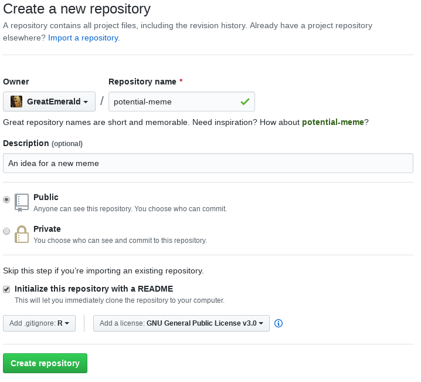

# [WUR Geoscripting](https://geoscripting-wur.github.io/) 


# Week 1, Lesson 1: Carrying out your scripting project 

<!-- TODO: Move to Brightspace

Good morning! 
Here is what you will do today:

Time  | Activity
------------- | -------------
Morning  |  Self-study: go through the following tutorial
14:00 to 15:00  | Presentation and discussion
Rest of the afternoon | Do/finalise the exercise. -->

## Course setup

```{block type="alert alert-info"}
**Important**: The Geoscripting course is a Master-level course given in Wageningen University. This set of documents that you are reading provide the theoretical material from the course for use both in the course itself, as well as for people who are following (parts of) the course externally or are in general interested in the topics that we cover. As such, these documents aim to be generic for all of the user groups above.

If you are a student following the course at Wageningen University (WUR), **please read** the information on [Brightspace](https://brightspace.wur.nl) and the Slack channel linked from it. All course-specific information can be found there. Information on Brightspace overrule any information written in these pages, so **please read it carefully** and **check it often**. You will also find all the information on deliverables and exercises there.

Throughout the whole course, we will be working in a Linux environment, and all of **the material has only been tested on (and assumes) a Linux environment**. While we will get into the details of what Linux is and why we use it in the next lesson, it is easiest if you **start using it also for this lesson**, as it will save you the trouble of setting up your version control twice. For WUR students, to find information on how to access your virtual machine, see the [VMWare Horizon tutorial](../Intro2Linux/vmware_horizon_tutorial.html).

While the majority of the software used in the course also works on other platforms (e.g. Windows and macOS), we will not cover their use outside of Linux, as it is outside the scope of the course. In case you don't know how to run a piece of software mentioned in the tutorial, chances are that you are not working in a proper Linux environment - please see the paragraph above!
```

## Introduction

Before we even start writing code, it is very important to think about the bigger picture: where are we going to store the code in the first place, and how do we want the folder structure to look like? For these reasons, today's tutorial focuses on version control systems and project management. At the end of the lesson, we also cover some of the basics in R.

## Learning objectives
At the end of the lecture, you should be able to

* Use version control to develop, maintain, and share your code with others
* Find help for R related issues
* Produce a reproducible example
* Refresh R skills and assessing scripting skills to see if you have the 
necessary scripting skills to continue with the course


# Version control

<!-- **Important note:** you need to have git installed and properly configured on your computer to do the following. Visit the [system setup page](http://geoscripting-wur.github.io/system_setup/) for more details. Git is preinstalled in the PC lab and on virtual machines already. -->

## What is version control?

Have you ever worked on a project and ended up having so many versions of your work that you didn't know which one was the latest, and what were the differences between the versions? Does the image below look familiar to you? Then you need to use version control (also called revision control). You will quickly understand that although it is designed primarily for big software development projects, being able to work with version control can be very helpful for scientists as well.

<center>

</center>

The video below explains some basic concepts of version control and what the benefits of using it are.

<iframe src="https://player.vimeo.com/video/41027679" width="500" height="300" frameborder="0" webkitallowfullscreen mozallowfullscreen allowfullscreen></iframe>
<p><a href="https://vimeo.com/41027679">What is VCS? (Git-SCM) &bull; Git Basics #1</a> from <a href="https://vimeo.com/github">GitHub</a> on <a href="https://vimeo.com">Vimeo</a>.</p>


So to sum up, version control allows to keep track of:

* When you made changes to your files
* Why you made these changes
* What you changed

Additionally, version control:

* Facilitates collaboration with others
* Allows you to keep your code archived in a safe place (the cloud)
* Allows you to go back to previous version of your code
* Allows you to find out what changes broke your code
* Allows you to have experimental branches without breaking your code
* Allows you to keep different versions of your code without having to worry about file names and archiving organization

The three most popular version control software are **Git**, **Mercurial** (abbreviated as hg) and **Subversion** (abbreviated as svn). *Git* is by far the most modern and popular one, so we will only use *Git* in this course.

## Git 

### What git does 

**Git** keeps track of changes in a **local repository** you set up on your computer. Typically that is a folder that contains all your code and optionally the data your code needs in order to run. The local repository contains all your files, but also (in a hidden folder) all the changes to the files you have made. It does not keep track of all files automatically: you need to tell git which files to track and which not. Therefore a repository contains your current tracked files (**workspace**), an **index** of files that are being tracked, and the version history.

Every time you make significant changes to the files in your workspace, you have to **add** the changed files to the index, which selects the files whose changes you want to save, and **commit** them, which means saving the changes to the history tracking of your local repository.

Often you also setup a **remote repository**, stored on an online platform like [GitHub](https://github.com/), [GitLab](https://gitlab.com) or others. It is simply a remotely-hosted mirror of your local repository and allows you to have your work stored in a safe place and accessible from your other computers and potential collaborators. Once in a while (at the end of the day, or every new commit if you want) you can **push** your commits, which means sending them to the remote repository so it keeps in sync with your local one. When you want to update your local repository based on the content of a remote repository, you have to **pull** the commits from the remote repository.

### Summary of git semantics

+ **add**: Tell git that you want a file or changes to be tracked. These files/changes  are not yet saved in the repository! They are listed as "staged" in the index or staging area for the next *commit*.
+ **commit**: Save the *staged* changes to your *local repository*. This is like putting a milestone or taking a snapshot of your project at that moment. A commit describes what has been changed, why and when. In the future you can always revert all tracked files to the state they were at when you created the commit.
+ **push**: Send previous changes you committed to the local repository to the remote repository.
+ **pull**: Update your local repository (and your workspace) with all new stuff from the remote repository. This command is simple, but potentially destructive, since it overwrites your files with the ones in the remote server. Hence it is not available in the Git GUI.
    + **fetch**: Get information about the latest commits from the remote repository, but do not apply them to your local repository automatically. This is always safe as it does not change your workspace.
    + **merge**: Merges two versions (branches) into one, applying the result to the workspace. This includes merging commits from the remote repository with the commits of the local repository. In effect, a **fetch** followed by a **merge** is the same as a **pull**, but it allows you more fine-grained control and is available through the Git GUI.
+ **clone** : Copy the content of a remote repository locally for the first time.
+ more advanced:
    + **branch** : Create a branch (a parallel version of the code in the repository)
    + **checkout**: load the status of a *branch* into your workspace


<center>

</center>


## Setting up a Git project

Effective use of git includes two components: local software to manage the files on your computer (git client) and an online git hosting service to make them centrally accessible. While git is a single system, there is a variety of clients and a variety of hosts.

In this course, we will primarily use Git GUI as the client. It is a simple client that is included with Git itself, and is language-agnostic. There are more graphical clients as well, including one integrated into RStudio itself, but these clients are outside the scope of this course.

```{block, type="alert alert-info"}
**Protip**: For those who are comfortable with working from the Linux terminal, the command line client is often the most efficient choice. Knowing how to use git from the command line is also useful when working on cloud virtual machines/servers for big data processing. So in protip boxes like this you will find command line equivalents to the GUI actions we will perform. Choose whichever way you find the most convenient for yourself.
```

Throughout the Geoscripting course, for hosting our code, we will be using [GitHub](https://github.com), the most popular Git hosting platform. Conveniently enough, it also provides [GitHub Classroom](https://classroom.github.com), a platform that makes submitting programming exercises easier!

Let's jump right into it! We will start by making our very own GitHub scripting project from scratch, and also try forking someone else's project.

### Client setup

1. *Launch Git GUI*

Launch a program called *Git GUI* (e.g. from the *Applications* → *Programming* menu). Git GUI is a graphical interface to Git that comes with Git itself, and is thus cross-platform and always available. When launched, it looks something like this:


```{block, type="alert alert-info"}
**Note**: External users should [download git](https://git-scm.com/download/) and install it to obtain Git GUI.

**Protip**: You can launch Git GUI from the terminal with `git gui`.
```

2. *Create an SSH key pair*

In order for GitHub (and other services) to identify that the machine connecting to it is indeed owned by you, there are two options: using a password, or using an SSH key. SSH keys are much more secure than passwords, and it doesn't require you to enter a password every time you try to communicate with the server. Therefore throughout the course we will use SSH keys.

You can generate a new SSH key pair in Git GUI by going to *Help* → *Show SSH Key* and pressing the *Generate Key* button. It will ask you for a **passphrase**. This is **not a password** and is completely **optional**: it is useful in the case your SSH key is stolen, for instance by a thief stealing your laptop or a virus; however, SSH keys are specific to each machine and are never sent over the network, so most of the time it is completely fine to **leave the passphrase empty**. If you keep it empty, you will **not need to enter it every time** you try to push your changes, yet the connection will be even more secure than when using a password.

Once done, you will see your new public key:


```{block, type="alert alert-info"}
**Protip**: From the command line you generate a key pair by running `ssh-keygen -t rsa -b 4096`. In both cases, by default the public key is stored in the file `~/.ssh/id_rsa.pub` (where `~` indicates the user's home directory).
```

### Account setup

Next, we will link our client with a Git host so that we can download and upload repositories.

3. *Log into GitHub*

Go to [GitHub](https://github.com/) and log in (register in case you don't have an account yet).

4. *Enrol the public key to your user account*

The SSH key pair is used to identify that you own the machine. <!--On WUR Windows PCs, the keys are stored on your *M:* drive, so they will follow you on any computer in the university.--> On WUR Linux virtual desktop instances (VDIs) via MyWorkspace/VMware Horizon, the keys are stored on your personal VDI, so you can access them from anywhere.

Now you need to tell GitHub about your new key. To do that, copy the public key from the dialog, then in GitHub click on your avatar in the top right and go to *Settings* → *SSH and GPG keys*. Click *New SSH Key*, give it a title describing your machine, paste the public key in the box, and press *Add SSH key*. You might need to confirm the key by email for added security.

This only has to be done once (per machine/OS you use GitHub on).

### Creating a new repository

5. *Create remote repository*

Now we are ready to start making new repositories! In GitHub, press the "+" button at the top right and select *New repository*. Give it a descriptive name and a short description, choose the visibility of the repository and check *Initialize this repository with a README*.



<!-- **Note:** During the course you are asked to submit answers to exercises as **separate projects**, using a specific scheme for the repository name: `Geoscripting-Exercise<id>-<team>` where `<id>` is the exercise number and `<team>` is your team name, for instance, `Geoscripting-Exercise3-TheGitters`. In addition, the visibility level **must** be set to *Private*. **Submissions that do not follow these rules may be rejected!** -->

You are also asked to provide a *license* for your code. That is a good idea in general, as choosing a license is crucial to let others know what you allow them to do with your code. Code without a license is copyright by default, and thus nobody is allowed to make use of your code or contribute to it. For real projects, you will want to set a more permissive license so that others could make use of your code. See [Choose a License](http://choosealicense.com/) for a quick overview of what licenses are available.

In addition, you can add a `.gitignore` file. This is useful to prevent Git from tracking files that you don't want to keep track of, like temporary files or your R command history. The options are sorted by language, so you can select your language of choice, e.g. `R`.

6. *Configure repository settings*

Explore your new blank repository a bit. On the tabs on the top, you can find that the repository can have issues and pull requests assigned to them. **Issues** is what is used to give feedback on code, so try and make a few issues and close them. It is useful to know how to use these, as for personal projects it can be used as a to-do list, and for others' projects you can use it to report bugs or propose suggestions. You may be surprised how responsive developers can be to newly raised issues!


Next, check out the repository settings. Under the *Collaborators* tab of *Settings*, you can invite other people to collaborate on your repository. Go ahead and invite your team member to be a collabortor with full permissions.

<!-- **Note:** During the course you are also required to add a staff member to your project with *Master* privileges before the submission deadline of each exercise in order for your exercise answer to be graded. The username of the staff member you need to add can be found on Blackboard. Do not share the repository with a group. **Submissions that do not follow this rule will be rejected!** -->

7. *Get the URL of your new repository*

Now that you have a remote repository, it's time to create a local repository that links to it! Open the main page of your new repository, click the green *Clone or download* button at the top right of the page, and copy the *Clone with **SSH** * address of your new repository.


<!--  -->

8. *Clone your repository*

Go back to Git GUI, and press *Clone Existing Repository*. Paste the URL you just copied to the *Source Location* field, and choose a folder you want to store your code in in the *Target Directory* field. **Note**: the *Target Directory* must **not** already exist! Git GUI will create it for you.

Once you click *Clone*, you will get a question about whether you trust the remote machine (if you ran `git gui` from a command line, it will appear stuck, but actually **the question will appear in the terminal** and you need to answer it there). You need to answer this with `yes` (the full word). This puts the GitHub server into a list of trusted servers, to guard against potential impostor servers.

You will end up in an empty Git GUI window:


```{block, type="alert alert-info"}
**Protip**: From the terminal, `cd` into the directory you want to clone into, and run `git clone <url>`, e.g. `git clone git@git.wur.nl:you001/example.git`. The repository will be cloned into a subdirectory with a matching name. This is much faster than using any GUI!
```

9. *Tell Git who you are*

Before you start using Git, you should tell it what your name and email address is. You need to do that only once per Git installation. You should go to *Edit* → *Options...* and fill out the *Global (All Repositories)* options *User Name* and *Email Address*. These will be displayed on GitHub.

```{block, type="alert alert-info"}
**Protip**: To set your user name and email from the command line:

    git config --global user.name "Your Name"
    git config --global user.email you@example.com

```

### Working with Git GUI

10. *Make changes*

To see Git in action, you need to make some changes in your repository. Try it by creating a new R script file in the directory where you cloned your new project.

Once you are done, go back to Git GUI. If you closed the window, you can get back to your repository by launching Git GUI and clicking on its path in the *Open Recent Repository* list. If you did not close it, click the *Rescan* button. You will see some changes:


```{block, type="alert alert-info"}
**Protip**: To see a list of files with pending changes from the command line, use `git status` while in a git repository. To see what exactly changed in each of these files, use `git diff`.
```

At the top left corner, the *Unstaged Changes* panel, you can see all the files that changed in your workspace. If you click on the **name** of the file, the main panel will show you what changed since the last commit. Unless it is a non-text (data) file, in which case it will just note that something has changed. **Note**: Git is very efficient with storing changes in text files: these *diff* files are all it stores internally, it does not copy the whole file on each commit. However, it does not deal efficiently with non-text files, and thus you should limit the amount and size of such files as much as possible.

If you click on the **icon** of the file in the *Unstaged Changes* panel, the file changes will be *staged* and appear at the *Staged Changes (Will Commit)* panel. These are the file changes you want to save and sent to GitLab. You don't have to stage all files for each commit, only those you actually want to be tracked by git. You can safely ignore some files such as manual backups, temporary files, and the like and they will remain untracked by git, as long as you never stage them. If you do want to stage everything, you can press the *Stage Changed* button. If you staged more than you wanted to, you can click on the file **icon** in the *Staged Changes* panel to unstage it.

Remember: clicking the **name** of the file shows the changes you made, clicking the **icon** of the file stages or unstages the change!

```{block, type="alert alert-info"}
**Protip**: To stage a change from the command line, use `git add path/to/file.ext` where `path/to/file.ext` is the file you want to stage. To unstage, use `git reset HEAD path/to/file.ext`.

If you have files that you don't want git to track, you can add them into the `.gitignore` file. It could be the name of a file, a directory, a wildcard (e.g. `*.pdf`), or any combination of these. To list several, put them on separate lines.
```

11. *Commit changes*

Once you staged the files that you want to commit, you need to fill out the *commit message*. This is a brief description of what changes you made between the last commit and the one you are about to create. The **first line** you enter is the **title** of the commit, keep that one short. Subsequent lines are the **description**. You may notice that the *Commit message* box does not have a horizontal scrollbar: that is intentional, because your commit message should fit within that box without the need for scrolling. Use new lines to break the text.

If it is the first time you use Git GUI to make a commit, and you haven't filled out your user name and email, it might complain about it not knowing who you are. In that case go back to step 9.

Next press the *Commit* button and your commit will be saved locally. A commit is like a saved state: you are always able to roll back the contents of your tracked files to the state they were in when you committed the changes.

```{block, type="alert alert-info"}
**Protip**: To commit a change from the command line, use `git commit`. If you want to stage all tracked and changed files and commit, use `git commit -a`.
```

In the case you made a mistake (a mistake in the message, forgot to stage something, etc.), you can press the *Amend Last Commit* button and get right back to where you were when you made the last commit; but use this functionality very sparingly, as it does not work with changes that have already been pushed to GitHub.

```{block, type="alert alert-info"}
**Protip**: To amend the last commit from the command line, use `git commit \-\-amend`.
```

10. *Push changes to the server*

Press the *Push* button, and confirm the push, to send all your changes to your GitHub repository. You can now refresh the GitHub page to see your changes. Well done!


```{block, type="alert alert-info"}
**Protip**: To push changes from the command line, use `git push`.
```

11. *Pull changes from the server*

One of the major uses of Git is collaboration and the ability to synchronise changes across different devices. Multiple users can do changes in the same Git repository (as long as you change the repository settings in GitHub to allow another user to do that), and you can work on the same code on different devices yourself. In both cases, it is important to keep all local repositories in sync with the remote repository. That is done via Git GUI by using *Fetch* and *Merge*. If you like, you can test it by cloning the same repository in another folder, making changes and pushing them to the server, then using fetch in the other copy.

If there are any changes on GitHub that are not on your local copy yet, in Git GUI go to *Remote* → *Fetch from* → *origin* to download all changes. This will not apply them yet, however. 

To attempt to apply the changes, go to *Merge* → *Local Merge...*. If all goes well, the changes will be applied.

```{block, type="alert alert-info"}
**Protip**: To do a fetch and merge together the command line, use `git pull`.
```

There may be cases where files go out of sync in incompatible ways, however, like two people editing one file at the same time. In that case you may hit a *merge conflict*. It is best to try to avoid them. In case it happens, you need to go through the conflicting files in a text editor and edit them by hand, keeping the parts of the files you need. The conflicting parts will be in between lines of of `>>>>` and `<<<<` symbols. Once you remove the parts you don't need (including the separators), you can solve the conflict by committing the changes.

### Forks and pull requests

Now we know how to work with Git and GitHub for our personal work, and how to collaborate on a project with your team member. But what if you want to contribute code to someone else who has not given you access rights, or what if you want to review the code before it's accepted to your repository? That's where forking and pull requests come in handy (respectively)!

A fork is your own personal copy of someone else's repository. GitHub allows you to fork any public repository. You want to make forks whenever you want to edit code but do not have direct commit rights.

```{block, type="alert alert-info"}
**Protip**: In fact, if you click the edit button on a file on GitHub and do changes to a repository that you don't have the rights to write into, GitHub will helpfully make a fork for you, followed by a proposal to make a pull request for your changes.
```

12. *Fork a repository*

Go to your team member's repository that they created by following the steps above, and then click the *Fork* button at the top right. (If you can't find it, alternatively you can go to some other repository, e.g. [the first exercise](https://github.com/geoscripting-innovation/Exercise1-starter), and fork it). You will find a new repository under your profile, with the same name as the original.


13. *Make changes, commit and push*

After you have your own fork, it is the same as having your own personal repository with the code from the original (*upstream*) repository in it. Clone it locally, make some changes, commit them and push them back to GitHub, as per steps 7-10. You should see that your changes take effect in your own *downsteam* fork, but not in the upstream repository.

14. *Make a pull request*

If you are ready to ask the upstream developers to incorporate your code into their repository, go to the Pull Requests tab and press the green *New pull request* button.


This will show you all the changes you have made, and if that is what you want to propose for the upstream developers to incorporate, click on the *Create pull request* button, upon which you can give the name for your pull request (changeset) and a description as to why the upstream developers would want to incorporate your code. After you confirm by clicking *Create pull request* again, the pull request will be visible in the pull requests tab of the *upstream* repository:


Then it's up to the upstream developers to perform a code review and either accept or reject the pull request in the end.

```{block, type="alert alert-info"}
**Protip**: For code review, GitHub also has special tools. If you look at the *Files changed* tab of a pull request, you will see that you can press a "+" button next to any line of code and write a comment about it. Once finished, there is a "Review changes" button at the top left that allows you to enter the final verdict and an overall comment.
```

### Other Git GUI functionality

You might run into a situation when you have made changes in tracked files, but do not want to keep some of the changes. You can revert one file by selecting it in Git GUI, then clicking *Commit* → *Revert changes*.

```{block, type="alert alert-info"}
**Protip**: The command line equivalent is `git checkout \-\- path/to/file.ext`, or if you want to reset all changed files, `git reset \-\-hard`.
```

Git GUI not only provides a way to make, push and pull commits, but also to visualise the commit history of your repository in a tree graph. Go to *Repository* → *Visualise Master's History* to see it. For larger and more complex projects with lots of contributors and merges, it might look like some sort of a subway map:


```{block, type="alert alert-info"}
**Protip**: The command line equivalent is `git log`.
```

The history view also allows you to reset the state of the repository to any previous commit by using the context menu. Note, however, that you can only push if you are on the latest commit. So the easiest way to revert changes is to copy over the files to a temporary directory outside of git, reset back, and move the files back into your repository.

```{block, type="alert alert-info"}
**Protip**: A few more options are available from the command line. `git revert <commit>` will undo changes from a given commit, where `<commit>` is the commit ID (you can get commit IDs from `git log`, they look like a long string of letters and numbers). `git checkout <commit> \-\- path/to/file.ext` will reset a single file to the state it was at the given commit.
```

You can also browse the history of a repository from your Git hosting service, and GitHub/GitLab even allow editing files from a web interface.

```{block, type="alert alert-success"}
> **Question**: How do you find commit history and old versions of your files on GitHub/GitLab?
```

That's it: now you know how to keep track of all your files, so you will never lose them again, and no longer have to worry about making backups or saving multiple versions. In addition, this is the way that free and open-source code development happens in actuality. Also, the exercises and assignments in the course will be delivered and submitted this way, so make sure you are familiar with the whole process!

## Project structure

Try to keep a consistent structure across your projects, so that it is easier for you to switch from one project to the other and immediately understand how things work. In most cases, the project structure is entirely up to you. In some cases, however, hte structure may be somewhat mandated, for instance, if you wish to make an R package. To make it easier to make a package out of your code, we will follow the structure of R packages:

* A `main.R` script at the root of the project. This script performs step by step the different operations of your project. It is the only non-generic part of your project (it contains paths, already set variables, etc). If you are making a package, this should instead be a demo and live as `demo/main.R`.
* An `R/` subdirectory: This directory should contain the functions you have defined as part of your project. These functions should be as generic as possible and are *sourced* and called by the `main.R` script. Or, if it's a package, `library(packagename)` makes them all available without needing to use `source()` manually.
* A `data/` subdirectory: This directory contains data sets of the project. Since Git is not as efficient with non-text files, and GitHub has storage limits, you should only put small data sets in that directory (<2-3 MB). These can be geopackages, small rasters, csv files, or R archives. R offers two types of archives to store the important variables of the environments, `.rda` and `.rds`.
* An `output/` sub directory (when applicable). This should not be tracked by git, since your scripts create the output, so there is no need to store it.
* For packages, a `DESCRIPTION` file is necessary. As the name implies, it contains a description of your package, its name and the name of the authors, but also describes what other packages your package needs to function correctly. Optionally, see [the documentation of the `DESCRIPTION` file](http://r-pkgs.had.co.nz/description.html) for more information.

Note that other languages propose slightly different structures, e.g. Python modules store all functions in a directory that is named the same as the package itself, e.g. for a package named `packagename`, instead of a directory called `R` you'd use a directory called `packagename`. Instead of `DESCRIPTION`, Python uses `setup.py` and `requirements.txt`. However, as long as you are familiar with the project/package structure of one language, switching to another is a breeze!

<center>

</center>

### Example `main.R` file

Typically the header of your main script will look like that.


```{r, eval=FALSE}
# Team Teamname (John Doe and Jane Smith)
# January 2020

# Import packages
library(raster)
library(sf)

# Source functions
source('R/function1.R')
source('R/function2.R')

# Load datasets 
load('data/input_model.rda')

# Then the actual commands

```

### Working directory, relative and absolute file paths

As you can see in the example file above, we source a file from our project using **relative** file paths. The reason why they are called *relative* is because they are *relative* to the **working directory**, which is the directory *from which the script is called*. By convention, the working directory is the same as the location of the script itself. This means that you can simply assume that whoever runs your script, will run it from the directory that your script is located.

```{block, type="alert alert-danger"}
**Note**: this also means that when you test others' code, you should also make sure to run it from the directory that the script is located, unless stated otherwise!
```

To refer to directories or files that are within the working directory, we simply use their names. So to refer to a directory called `R` in our working directory, we type `R`. To refer to a file or directory within another directory, we type the name of the directory, a slash, and then the name of the file/directory, for instance, `R/function1.R`.

```{block, type="alert alert-danger"}
**Note**: on Windows, you might see a backslash (`\\`) being used as a path separator instead of a slash (`/`). **Don't do this**! In many languages, including R, a backslash denotes an [escape sequence](https://en.wikipedia.org/wiki/Escape_sequence). In addition, a backslash is not a valid path separator on non-Windows platforms, whereas both a slash and a backslash are valid on Windows. So save yourself the trouble and **always use a slash as a path separator**!
```

If we want to refer to a file or directory that is above the indicated directory, we use the special directory `..`. For instance, if our `main.R` is not in our project root, but located in the subdirectory `demo` (therefore our working directory is `demo`), we would refer to our `function1.R` file as `../R/function1.R`. Another special directory is `.`, which refers to the indicated directory itself.

In contrast, an **absolute** file path refers to a file from the root of the entire file system. For instance, on Windows, an absolute file path could be `C:/Windows/cmd.exe`, or equivalently `/Windows/cmd.exe`. On Linux (and other UNIX-like systems like macOS), absolute file paths **always** start with `/`, for instance, `/home/user/proposed-meme/R/function1.R`.

When making Git repository, you want to make sure that all your code is *portable* and self-contained, i.e. you can run it from any computer, and ideally using any operating system. That means that as a rule of thumb you should **always use relative file paths** in your scripts.

```{block, type="alert alert-success"}
> **Question**: what would be the location of this file: `././R/./.././R/./././function2.R`? How about `/./R/./.././R/./././function2.R`? What would be the meaning of `C:/Windows/cmd.exe` on Linux? Is it a relative or absolute file path?
```

<!--
### Bigger data
The `data/` directory of your project should indeed only contain relatively small data sets. When handling bigger remote sensing data sets, these should stay out of the project, where you store the rest of your data.


### Example
* Create 3 files in your `R/` directory (`ageCalculator.R`, `HelloWorld.R` and `minusRaster.R`) in which you will copy paste the respective functions.
* Create a `main.R` script at the root of your project and add some code to it. The content of the `main.R` in that case could be something as below.

```{r, eval=FALSE}
# Name
# Date
library(raster)

source('R/ageCalculator.R')
source('R/HelloWorld.R')
source('R/minusRaster.R')


HelloWorld('john')
ageCalculator(2009)

# import dataset
r <- raster(system.file("external/rlogo.grd", package="raster")) 
r2 <- r 
# Filling the rasterLayer with new values.
r2[] <- (1:ncell(r2)) / 10
# Performs the calculation
r3 <- minusRaster(r, r2) 
```


### RStudio projects

RStudio has a functionality called *projects* that allows organising your files a bit better. You may have learned that one of the first things to do when opening a R session is to set your working directory, using the `setwd()` command. When creating a new project, the working directory is automatically set to the root of the project, where your `main.R` is located. When working with RStudio projects you should not change the working directory. If you want to access files stored in your `data/` subdirectory, simply append `data/` to the beginning of the string leading to the file you want to load.

**Note**: RStudio projects are specific to RStudio and are not usable with base R or with other R IDEs. The use of RStudio projects is optional and is merely for convenience. When using other IDEs you can assume the user will set the working directory to where the script is located.

RStudio itself has integration with Git, and when creating a project there is an option to make it a git repository as well. However, in this lesson we will not be using this method, since it is specific to RStudio and does not work for Python or in other R IDEs. Git GUI, in contrast, is language-agnostic and standalone. So if you do create a project with RStudio, create it inside your cloned GitHub repository, and do **not** select that it creates a new git repository, then use Git GUI to handle all the changes you do in the repository. This will save you the confusion about how to handle it when we will come to Python lessons.

-->

# Basic *R* and *RStudio* setup {#gettingstarted}

This preliminary section will cover some basic details about *R*. For this course you can use RStudio to write and run scripts. You can access it from e.g. *Applications* → *Programming* → *RStudio* menu.
In case you are working on your own computer and would like to know how to install *R* and *RStudio*, see the [RStudio website](https://www.rstudio.com/products/rstudio/download/).

<!--

```{block type="alert alert-info"}
**Protip**: if you are following the course externally, you can also set up all the rest of the necessary software for the course now. See the [system setup page](https://geoscripting-wur.github.io/system_setup/) for instructions. This is not necessary for enrolled students, as all the software will be provided in the upcoming lessons.
```
-->

## Getting started with *RStudio* and *R* on your own computer.

A summary YouTube movie about how to use RStudio and writing a function is here: [Intro to RStudio](https://www.youtube.com/watch?v=jPk6-3prknk). Have a look at this movie if you do not know how to work with RStudio and then do the following section. See the following tutorial for a [short introduction on the RStudio interface](http://cran.r-project.org/doc/contrib/Torfs+Brauer-Short-R-Intro.pdf).

Now, Open RStudio and type the following script in the R console of **RStudio**:

```{r}
a = 1
a
```

The first line you passed to the console created a new object named  $a$ in memory.
The equals symbol `=` is somewhat equivalent to an arrow symbol `<-` for assigning values to variables. In the second line you printed $a$ to the console by simply typing its name.

**What is the class of this object?**

```{r}
class(a)
```

You now have requested the class attribute of $a$ and the console has returned the attribute: numeric. R possesses a simple mechanism to support an object-oriented style of programming. All objects ($a$ in this case) have a class attribute assigned to them. R is quite forgiving and will assign a class to an object even if you haven't specified one (as you didn't in this case). Classes are a very important feature of the R environment. Any function or method that is applied to an object takes into account its class and uses this information to determine the correct course of action.

## Set Your Working Directory

Let's do some basic set up first.

- Create a git repository which will be your working directory e.g. `Lesson1`
- Create an R script within that directory
- Set your working directory to `Lesson1`
- Create a `data` directory within your working directory

In RStudio you can set your working directory this way, if you have saved your R script to your working directory:


```{block, type="alert alert-danger"}
**Warning**: The use of `setwd()` is not a good practice in scripts without a very, very good reason. The users are aware of the environment and working directories and scripts should not try to outsmart the users.

*Never set either of the following in your script! This would make the script not reproducible by others!*

    setwd("/some/path/on/your/computer")
    setwd("../some/path/outside/your/repository")
```


```{block type="alert alert-info"}
**Protip**: You can use relative paths to load your data. 
For example by setting the path to a 
file "my-table.csv" in the directory "data", relative to your script file:

    datafile <- file.path("data", "my-table.csv")

Then you can for example read in the file using:

    mytable <- read.csv(datafile) # Do something with that file name

```

The above Protip is very important, so make sure you understand this and use this 
within the geo-scripting exercises.

# Finding help
Great, now we are all set to dive into scripting itself! But how do we know *how* and *what* to write? Even the most experienced programmers run into these questions, so it's important to know how to find answers to them.

## Sources for help
The most important helper is the R documentation. In the R console, just enter `?functionName` or `help(functionName)` to get the manual page of the function you are interested in.

**Protip**: to get the help page for a reserved keyword, wrap it in backticks `` ` ``. For instance, to learn about how to define a function, you can run `` ?`function` ``. In addition, to cancel input for a running command (e.g. to get out of `?function`), press the `Esc` key.

There are many places where help can be found on the internet. So in case the function or package documentation is not sufficient for what you are trying to achieve, a search engine like Google is your best friend. Most likely by searching the right key words relating to your problem, the search engine will direct you to the archive of the R mailing list, or to some discussions on [Stack Exchange](http://stackexchange.com/). These two are reliable sources of information, and it is quite likely that the problem you are trying to figure out has already been answered before.

However, it may also happen that you discover a *bug* or something that you would qualify as abnormal behavior, or that you really have a question that no one has ever asked (corollary: has never been answered). In that case, you may submit a question to one of the R mailing list. For general R question there is a general [R mailing list](https://stat.ethz.ch/mailman/listinfo/r-help), while the spatial domain has its own mailing list ([R SIG GEO](https://stat.ethz.ch/mailman/listinfo/r-sig-geo)). Geo related questions should be posted to this latter mailing list.

**Note**: these mailing lists have heavy mail traffic, use your mail client efficiently and set filters, otherwise it will quickly bother you.

These mailing lists have a few rules, and it's important to respect them in order to ensure that:

* no one gets offended by your question,
* people who are able to answer the question are actually willing to do so,
* you get the best quality answer.


So, when posting to the mail list: 

* Be courteous.
* Provide a brief description of the problem and why you are trying to do that.
* Provide a reproducible example that illustrate the problem, reproducing the eventual error.
* Sign with your name and your affiliation.
* Do not expect an immediate answer (although well presented questions often get answered fairly quickly).


## Reproducible examples (reprex)

Indispensable when asking a question to the online community, being able to write a reproducible example has many advantages:

- It may ensure that when you present a problem, people are able to answer your question without guessing what you are trying to do. 
- Reproducible examples are not only to ask questions; they may help you in your thinking, developing or debugging process when writing your own functions. 
    - For instance, when developing a function to do a certain type of raster calculation, start by testing it on a small auto-generated RasterLayer object, and not directly on your actual data that might be covering the whole world.

### Example of a reproducible example

Well, one could define a reproducible example by:

- A piece of code that can be executed by anyone who has R, independently of the data present on his machine or any preloaded variables. 
- The computation time should not exceed a few seconds and if the code automatically downloads data, the data volume should be as small as possible.

*So basically, if you can quickly start a R session on your neighbour's computer while he is on a break, copy-paste the code without making any adjustments and see almost immediately what you want to demonstrate; congratulations, you have created a reproducible example.*

Let's illustrate this by an example.
I want to perform value replacements of one raster layer, based on the values of another raster layer. (We haven't covered raster analysis in R as part of the course yet, but you will quickly understand that for certain operations rasters are analog to two-dimensional arrays.)

```{r, fig.align='center'}
## Create two RasterLayer objects of similar extent
library(raster)
r <- s <- raster(ncol=50, nrow=50)
## Fill the raster with values
r[] <- 1:ncell(r)
s[] <- 2 * (1:ncell(s))
s[200:400] <- 150
s[50:150] <- 151
## Perform the replacement
r[s %in% c(150, 151)] <- NA
## Visualise the result
plot(r)
```

Once you have a reproducible example, you can make sure it's reproducible by using the [reprex package](https://www.tidyverse.org/help/). It will double-check for you that your code is reproducible and copy a neatly-formatted reprex into your clipboard, ready for sending it to others!

Useful to know when writing a reproducible example: instead of generating your own small data sets (vectors or RasterLayers, etc) as part of your reproducible example, use some of R *built-in* data-sets. They are part of the main R packages.
Some popular data sets are: `cars`, `meuse.grid_ll`, `Rlogo`, `iris`, etc. The [auto completion](http://en.wikipedia.org/wiki/Autocomplete) menu of the `data()` function will give you an overview of the data sets available.

```{block, type="alert alert-info"}
**Protip**: In most script editing environments, including the R console and RStudio, auto-completion can be invoked by pressing the tab key, use it without moderation.
```

```{r, echo=TRUE, fig.align='center'}
## Import the variable "cars" in the working environment
data(cars)
class(cars)
## Visualise the first six rows of the variable
head(cars)
# The plot function on this type of dataset (class = data.frame, 2 column)
# automatically generates a scatterplot
plot(cars)
```

<!-- TODO: replace with `sf` and `nc` (North Carolina statistics)
Another famous data set is the `meuse` data set, providing all sorts of spatial variables spread across a part of the Meuse watershed.
The following example compiled from the help pages of the `sp` package.

```{r}
## Example using built-in dataset from the sp package
library(sp)
## Load required datastes
data(meuse)
# The meuse dataset is not by default a spatial object
# but its x, y coordinates are part of the data.frame
class(meuse)
coordinates(meuse) <- c("x", "y")
class(meuse)
```

Now that the object belongs to a spatial class, we can plot it using one of the vector plotting functions of the `sp` package. See the result in the figure below.

```{r, echo=TRUE, fig.align='center'}
bubble(meuse, "zinc", maxsize = 2.5,
       main = "zinc concentrations (ppm)", key.entries = 2^(-1:4))
```

The `sp` package help page contains multiple examples of how to explore its `meuse` built-in data set. Another example of multiple plots using `meuse.grid` is given in the figure below.

```{r, echo=TRUE, fig=TRUE, fig.align='center'}
## Load meuse.riv dataset
data(meuse.riv)
## Create an object of class SpatialPolygons from meuse.riv
meuse.sr <- SpatialPolygons(list(Polygons(list(Polygon(meuse.riv)),"meuse.riv")))
## Load the meuse.grid dataset
data(meuse.grid)
## Assign coordinates to the dataset and make it a grid
coordinates(meuse.grid) = c("x", "y")
gridded(meuse.grid) = TRUE
## Plot all variables of the meuse.grid dataset in a multiple window spplot
spplot(meuse.grid, col.regions=bpy.colors(), main = "meuse.grid",
       sp.layout=list(
           list("sp.polygons", meuse.sr),
           list("sp.points", meuse, pch="+", col="black")
           )
       )
```
-->

<!-- Ported over to GitHub starter repo

# Exercise 3
## Your task
Create a GitLab project on the WUR instance. The project should contain a simple function to calculate whether or not a year is a leap year. Use control flow, and provide some examples of how the function works in the `main.R`.
The function should behave as follows:


```
> is.leap(2000)
[1] TRUE

> is.leap(1580)
Warning message:
In is.leap(year): 1580 was before the Gregorian calendar was in use, using proleptic Gregorian calendar
[1] TRUE

> is.leap(2002)
[1] FALSE

> is.leap('john') #should throw an error 
Error: argument of class numeric expected
```


## Useful resources

* [Google](https://www.google.com)
* [Leap Year](http://en.wikipedia.org/wiki/Leap_year)
* [R arithmetic oprators](http://stat.ethz.ch/R-manual/R-devel/library/base/html/Arithmetic.html)


## Assessment
When doing assessment, the following points are to be considered:

1. Whether the function works as intended
2. Whether the fucntion handles a variety of input, throws meaningful errors and warnings when appropriate.
3. Whether the function is readable, complete and type consistent.

The structure of your project and the appropriate use of git will also be assessed. For bonus points, try to make the function as short as possible: can you come up with a solution without using any `if` statements?

## How to submit?
```{block, type="alert alert-danger"}
**Important**: Please carefully read the submission instructions on Blackboard! You may not get scored if you submit your exercises incorrectly.
```

As a summary: create a **private** GitLab project with the name `Geoscripting-Exercise<id>-<teamname>`, where `<id>` is the number of the exercise (3 in today's case) and `<teamname>` is the name of your team. In the Members section of the project, add the staff members responsible for checking your exercises as members of the project and grant them "Maintainer" privileges. Finish the exercise by the deadline today. The staff will check it and publish your answers on the student group `Geoscripting<year>` on GitLab after the deadline.

You will need to give the team you are reviewing feedback on their exercise solution the next day (use the review team generator Shiny app to know who you are reviewing and who you are reviewed by). Answers from other groups will be available on the `Geoscripting<year>` group on GitLab. For reviewing other teams' answers:

* Clone the repository of the team you have to review to your computer and test it.
* Add an issue to their project and write out your review. Make sure to mention your team name in the review.

Once you receive issues on your repository with feedback, do not close them! They will be checked by staff as part of the assessment.

This is the way the exercises will need to be submitted and reviewed from this lesson on.

-->

# References

* Packages:
    * Reference document for creating R packages: [Writing R extensions](http://cran.r-project.org/doc/manuals/R-exts.html)
    * A set of good practices when creating packages: [R package development](http://mages.github.io/R_package_development/#1)
* Git:
    * Great 15 min interactive git commands tutorial: [try.github.io](https://try.github.io)
    * Hadley Wickham on [Rstudio and git](http://r-pkgs.had.co.nz/git.html#undefined)
    * R Studio documentation on version control: [Using Version Control with RStudio](http://www.rstudio.com/ide/docs/version_control/overview)
    * Video tutorial to use revision control with R Studio and GitHub/BitBucket [Youtube link](http://www.youtube.com/watch?v=jGeCCxdZsDQ&noredirect=1)
    * Advanced Git: [A successful git branching model](http://nvie.com/posts/a-successful-git-branching-model/)
* Debugging:
    * Hadely Wickham on [Debugging with RStudio](http://adv-r.had.co.nz/Exceptions-Debugging.html)
    * Reference manual for function debugging in R: [Manual](http://www.stats.uwo.ca/faculty/murdoch/software/debuggingR/).
